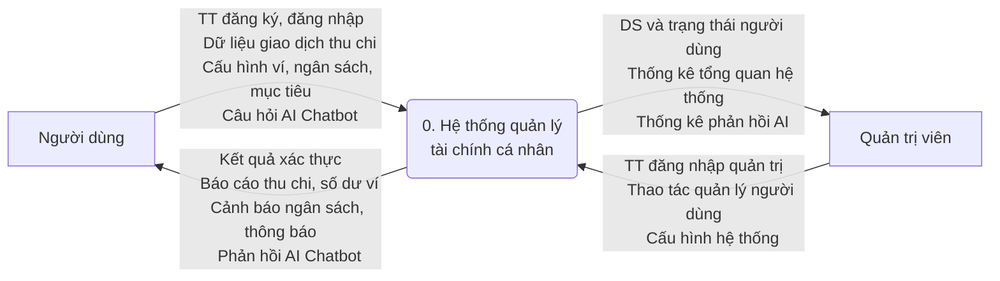
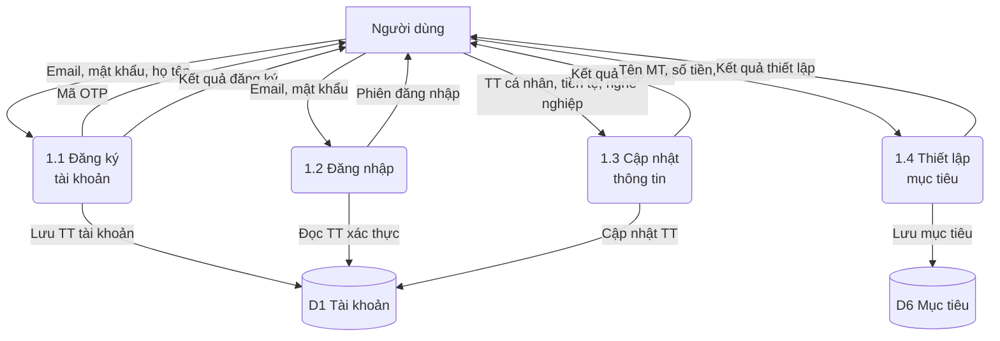
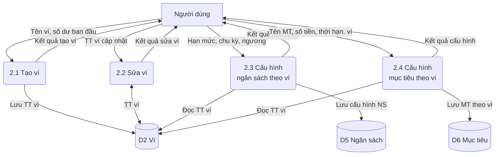
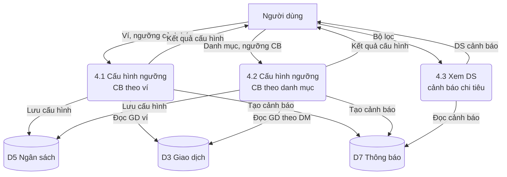
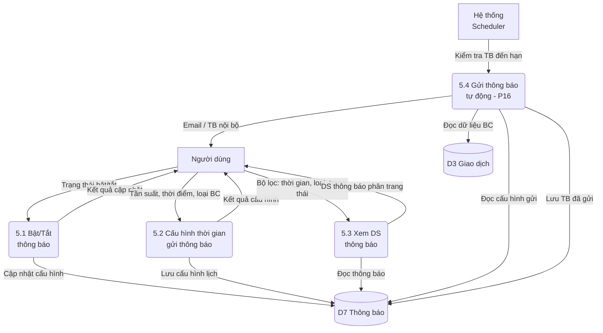
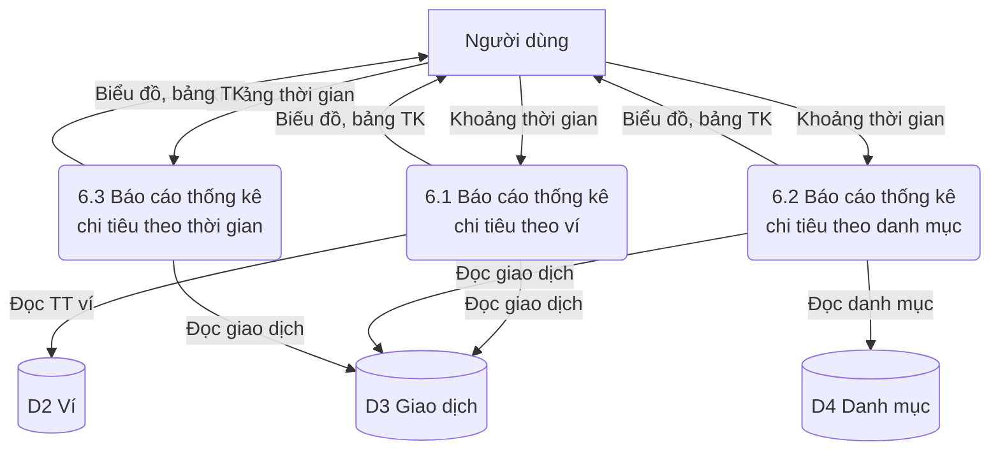
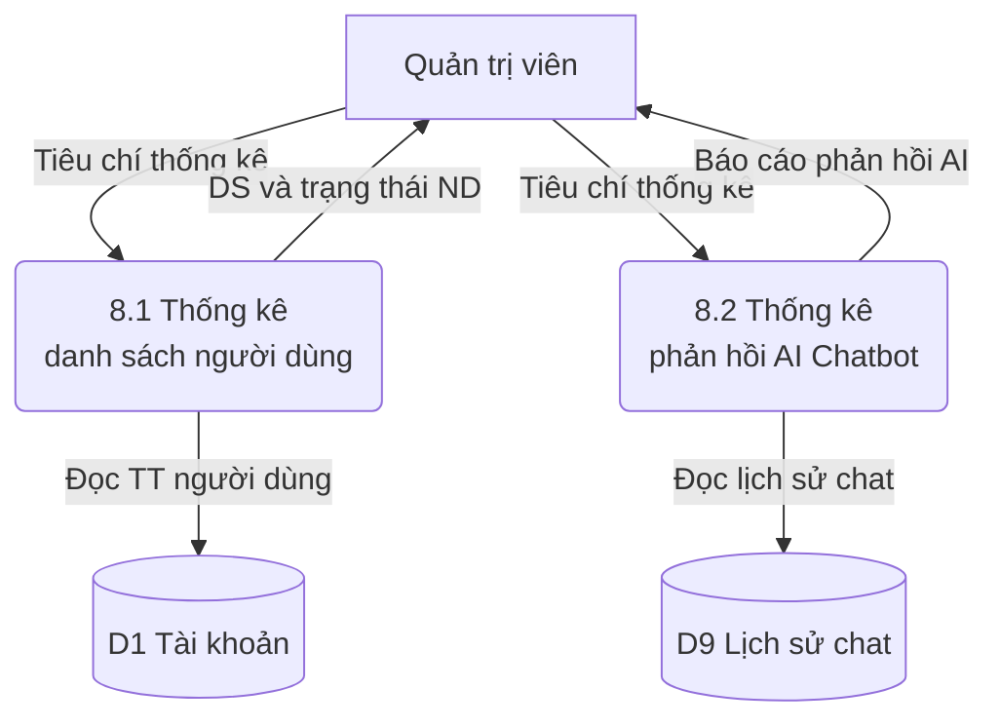

# 2.5. Mô hình hóa tiến trình nghiệp vụ

## 2.5.1. Ký hiệu sử dụng

| STT | Ký hiệu | Giải thích |
| :---: | :---: | ----- |
| 1 | Hình chữ nhật | Tác nhân trong/ngoài |
| 2 | Hình chữ nhật bo tròn | Tiến trình |
| 3 | Mũi tên | Luồng dữ liệu |
| 4 | Hình trụ | Kho dữ liệu |

Quy ước trong sơ đồ Mermaid:
- `["Tên"]` — Tác nhân (hình chữ nhật)
- `("Tên")` — Tiến trình (hình bo tròn)
- `[("Tên")]` — Kho dữ liệu (hình trụ)
- `-->|"Mô tả"|` — Luồng dữ liệu (mũi tên có nhãn)

---

## 2.5.2. Sơ đồ luồng dữ liệu (DFD) mức ngữ cảnh

Sơ đồ luồng dữ liệu mức ngữ cảnh thể hiện tổng quát hệ thống quản lý tài chính cá nhân như một tiến trình trung tâm duy nhất, tương tác với hai tác nhân bên ngoài: **Người dùng** và **Quản trị hệ thống**.

*Hình 2.4 Sơ đồ DFD mức ngữ cảnh*

**Mô tả luồng dữ liệu:**

| STT | Luồng | Mô tả |
|-----|-------|-------|
| 1 | Người dùng → Hệ thống | Thông tin đăng ký, đăng nhập; dữ liệu giao dịch thu chi; thông tin ví; cấu hình ngân sách, mục tiêu; câu hỏi gửi đến AI Chatbot |
| 2 | Hệ thống → Người dùng | Kết quả xác thực; báo cáo thu chi; số dư ví; cảnh báo vượt ngân sách; kết quả import; phản hồi và gợi ý từ AI Chatbot; thông báo hệ thống |
| 3 | Quản trị → Hệ thống | Thông tin đăng nhập quản trị; thao tác quản lý tài khoản người dùng; cấu hình danh mục hệ thống; cấu hình và giám sát AI Chatbot |
| 4 | Hệ thống → Quản trị | Danh sách và trạng thái người dùng; báo cáo thống kê tổng quan hệ thống; log hoạt động; trạng thái AI Chatbot |

---

## 2.5.3. DFD mức đỉnh

Sơ đồ luồng dữ liệu mức đỉnh phân rã tiến trình trung tâm "Hệ thống quản lý tài chính cá nhân" thành **8 tiến trình con** tương ứng với 8 nhóm chức năng đã xác định, cùng **9 kho dữ liệu**, 2 tác nhân bên ngoài và **các luồng liên tiến trình** (P13 điều phối giao dịch kích hoạt P08, P12).

```mermaid
flowchart TB
    %% === TÁC NHÂN ===
    ND["Người dùng"]
    QT["Quản trị viên"]
    HT["Hệ thống<br/>Scheduler"]

    %% === TIẾN TRÌNH ===
    P1("1.0<br/>Quản lý tài khoản")
    P2("2.0<br/>Quản lý ví")
    P3("3.0<br/>Quản lý thu chi")
    P4("4.0<br/>Quản lý ngân sách")
    P5("5.0<br/>Quản lý thông báo")
    P6("6.0<br/>Báo cáo thống kê")
    P7("7.0<br/>AI Chatbot")
    P8("8.0<br/>Quản lý hệ thống")

    %% === KHO DỮ LIỆU ===
    D1[("D1 Tài khoản")]
    D2[("D2 Ví")]
    D3[("D3 Giao dịch")]
    D4[("D4 Danh mục")]
    D5[("D5 Ngân sách")]
    D6[("D6 Mục tiêu")]
    D7[("D7 Thông báo")]
    D8[("D8 Cấu hình<br/>định kỳ")]
    D9[("D9 Lịch sử<br/>chat")]

    %% === LUỒNG: NGƯỜI DÙNG -> TIẾN TRÌNH ===
    ND -->|"TT đăng ký, đăng nhập"| P1
    ND -->|"TT ví, cấu hình"| P2
    ND -->|"Dữ liệu giao dịch, file Excel"| P3
    ND -->|"Cấu hình ngưỡng theo ví/DM"| P4
    ND -->|"Cấu hình thông báo"| P5
    ND -->|"Tiêu chí báo cáo"| P6
    ND -->|"Câu hỏi, yêu cầu phân tích"| P7

    %% === LUỒNG: TIẾN TRÌNH -> NGƯỜI DÙNG ===
    P1 -->|"Kết quả xác thực, OTP"| ND
    P2 -->|"DS ví, số dư"| ND
    P3 -->|"DS giao dịch, file Excel xuất"| ND
    P4 -->|"DS cảnh báo chi tiêu"| ND
    P5 -->|"DS thông báo"| ND
    P6 -->|"Biểu đồ, bảng thống kê"| ND
    P7 -->|"Phản hồi NLP, phân tích, tư vấn"| ND

    %% === LUỒNG: QUẢN TRỊ ===
    QT -->|"Thao tác quản lý ND, giám sát AI"| P8
    P8 -->|"DS người dùng, thống kê AI"| QT

    %% === LUỒNG: HỆ THỐNG SCHEDULER ===
    HT -->|"Kích hoạt GD định kỳ"| P3
    HT -->|"Kích hoạt gửi TB định kỳ"| P5

    %% === LUỒNG LIÊN TIẾN TRÌNH (P13 ĐIỀU PHỐI) ===
    P3 -.->|"GD mới → Kiểm tra ngân sách<br/>P13 điều phối"| P4
    P3 -.->|"GD mới → Cập nhật mục tiêu<br/>P08 tính % hoàn thành"| P1
    P4 -.->|"Cảnh báo vượt NS"| P5

    %% === LUỒNG: TIẾN TRÌNH <-> KHO DỮ LIỆU ===
    P1 <-->|"TT tài khoản"| D1
    P1 <-->|"Mục tiêu chung"| D6
    P2 <-->|"TT ví"| D2
    P2 <-->|"Cấu hình NS"| D5
    P2 <-->|"Mục tiêu theo ví"| D6
    P3 <-->|"Bản ghi GD"| D3
    P3 -->|"Cập nhật số dư"| D2
    P3 -->|"Đọc danh mục"| D4
    P3 <-->|"CH định kỳ"| D8
    P4 -->|"Đọc NS"| D5
    P4 -->|"Đọc GD"| D3
    P4 -->|"Lưu cảnh báo"| D7
    P5 <-->|"Thông báo"| D7
    P6 -->|"Đọc GD"| D3
    P6 -->|"Đọc ví"| D2
    P6 -->|"Đọc DM"| D4
    P7 -->|"Đọc GD"| D3
    P7 -->|"Đọc NS"| D5
    P7 -->|"Đọc MT"| D6
    P7 <-->|"Lịch sử chat"| D9
    P8 -->|"Đọc TT ND"| D1
    P8 -->|"Đọc phản hồi"| D9
```

*Hình 2.5 Sơ đồ DFD mức đỉnh*

**Danh sách tác nhân:**

| Ký hiệu | Tên | Mô tả |
|----------|-----|-------|
| ND | Người dùng | Cá nhân sử dụng hệ thống quản lý tài chính |
| QT | Quản trị viên | Người vận hành, giám sát hệ thống |
| HT | Hệ thống (Scheduler) | Bộ lập lịch tự động kích hoạt GD định kỳ (P11) và gửi thông báo (P16) |

**Danh sách kho dữ liệu:**

| Ký hiệu | Tên kho dữ liệu | Mô tả |
|----------|-----------------|-------|
| D1 | Tài khoản | Lưu trữ thông tin tài khoản người dùng, cấu hình cá nhân, mục tiêu |
| D2 | Ví | Thông tin ví tài chính, số dư hiện tại |
| D3 | Giao dịch | Các bản ghi giao dịch thu/chi (thủ công, import, định kỳ) |
| D4 | Danh mục | Danh mục phân loại giao dịch (Ăn uống, Di chuyển, ...) |
| D5 | Ngân sách | Cấu hình ngân sách chi tiêu theo ví/danh mục, ngưỡng cảnh báo |
| D6 | Mục tiêu | Mục tiêu tài chính chung và theo ví, tiến độ hoàn thành |
| D7 | Thông báo | Thông báo hệ thống, cảnh báo ngân sách, cấu hình gửi TB |
| D8 | Cấu hình định kỳ | Cấu hình giao dịch thu/chi cố định, trạng thái, thời điểm tiếp theo |
| D9 | Lịch sử chat | Lịch sử hội thoại AI Chatbot, câu hỏi và phản hồi |

**Luồng liên tiến trình (nét đứt):**

| Luồng | Mô tả | Quy trình liên quan |
|-------|-------|--------------------|
| 3.0 → 4.0 | Sau khi tạo giao dịch, kích hoạt kiểm tra ngân sách | P13 → P12 |
| 3.0 → 1.0 | Sau khi tạo giao dịch, cập nhật % hoàn thành mục tiêu | P13 → P08 |
| 4.0 → 5.0 | Khi vượt ngân sách, gửi cảnh báo ngay lập tức | P12 → P16 |

---

## 2.5.4. DFD mức dưới đỉnh

### 2.5.4.1. DFD mức 2 – Quản lý tài khoản

Phân rã tiến trình **1.0 Quản lý tài khoản** thành 4 tiến trình con tương ứng với các quy trình P01, P02, P03, P04.

*Hình 2.6 DFD mức 2 – Quản lý tài khoản*

---

### 2.5.4.2. DFD mức 2 – Quản lý ví

Phân rã tiến trình **2.0 Quản lý ví** thành 4 tiến trình con tương ứng với các quy trình P05, P06, P07.

*Hình 2.7 DFD mức 2 – Quản lý ví*

---

### 2.5.4.3. DFD mức 2 – Quản lý thu chi

Phân rã tiến trình **3.0 Quản lý thu chi** thành 7 tiến trình con tương ứng với các quy trình P09, P10, P11, P13, P08, P12. Bao gồm tiến trình **3.6 Điều phối giao dịch (P13)** — tiến trình nội bộ tự động kích hoạt kiểm tra ngân sách và cập nhật mục tiêu sau mỗi giao dịch.

*Hình 2.8 DFD mức 2 – Quản lý thu chi*

> **Ghi chú:** Nét đứt (`-.->`) thể hiện luồng kích hoạt nội bộ. Sau khi giao dịch được tạo thành công (từ 3.1, 3.2 hoặc 3.7), hệ thống tự động kích hoạt tiến trình **3.6 Điều phối giao dịch (P13)** để:
> - Kiểm tra cấu hình ngân sách → tạo cảnh báo nếu vượt ngưỡng (P12)
> - Kiểm tra mục tiêu tài chính → cập nhật % hoàn thành (P08)

---

### 2.5.4.4. DFD mức 2 – Quản lý ngân sách

Phân rã tiến trình **4.0 Quản lý ngân sách** thành 3 tiến trình con tương ứng với quy trình P12.

*Hình 2.9 DFD mức 2 – Quản lý ngân sách*

---

### 2.5.4.5. DFD mức 2 – Quản lý thông báo

Phân rã tiến trình **5.0 Quản lý thông báo** thành 4 tiến trình con tương ứng với các quy trình P15, P16. Bao gồm tiến trình **5.4 Gửi thông báo tự động (P16)** — nhận cảnh báo từ tiến trình 4.0 và gửi TB theo lịch.

*Hình 2.10 DFD mức 2 – Quản lý thông báo*

> **Ghi chú:** Tiến trình 5.4 xử lý hai loại thông báo:
> - **Thông báo theo lịch**: Gửi báo cáo định kỳ (tuần/tháng/quý/năm) theo cấu hình P15
> - **Thông báo tức thì**: Cảnh báo vượt ngân sách (từ P12), hoàn thành/quá hạn mục tiêu (từ P08) — gửi ngay không phụ thuộc lịch

---

### 2.5.4.6. DFD mức 2 – Quản lý báo cáo thống kê

Phân rã tiến trình **6.0 Báo cáo thống kê** thành 3 tiến trình con tương ứng với quy trình P14.

*Hình 2.11 DFD mức 2 – Báo cáo thống kê*

---

### 2.5.4.7. DFD mức 2 – AI Chatbot

Phân rã tiến trình **7.0 AI Chatbot** thành 3 tiến trình con tương ứng với các quy trình P17, P18, P19.

*Hình 2.12 DFD mức 2 – AI Chatbot*

---

### 2.5.4.8. DFD mức 2 – Quản lý hệ thống

Phân rã tiến trình **8.0 Quản lý hệ thống** thành 2 tiến trình con.

*Hình 2.13 DFD mức 2 – Quản lý hệ thống*

---

## Bảng tổng hợp ma trận Tiến trình – Kho dữ liệu

| Tiến trình | D1 | D2 | D3 | D4 | D5 | D6 | D7 | D8 | D9 |
|------------|:--:|:--:|:--:|:--:|:--:|:--:|:--:|:--:|:--:|
| 1.0 QL Tài khoản | R/W | | | | | W | | | |
| 2.0 QL Ví | | R/W | | | W | W | | | |
| 3.0 QL Thu chi | | W | R/W | R | | | | R/W | |
| 4.0 QL Ngân sách | | | R | | R | | W | | |
| 5.0 QL Thông báo | | | | | | | R/W | | |
| 6.0 Báo cáo TK | | R | R | R | | | | | |
| 7.0 AI Chatbot | | | R | | R | R | | | R/W |
| 8.0 QL Hệ thống | R | | | | | | | | R |

*Bảng 2.3 Ma trận CRUD Tiến trình – Kho dữ liệu (R: Đọc, W: Ghi, R/W: Đọc/Ghi)*

---

# 2.4. Đặc tả chức năng

## 2.4.1. Chức năng Quản lý tài khoản

### 2.4.1.1. Đăng ký

| Tên chức năng | Đăng ký tài khoản |
| :---- | :---- |
| **Tác nhân** | Người dùng |
| **Mô tả** | Cho phép người dùng tạo mới tài khoản để sử dụng hệ thống |
| **Đầu vào** | Email, mật khẩu, họ tên, mã OTP |
| **Đầu ra** | Tài khoản được tạo thành công |
| **Điều kiện trước** | Email chưa tồn tại trong hệ thống |
| **Điều kiện sau** | - Trường hợp thành công: Thông báo tạo tài khoản thành công - Trường hợp thất bại: Nhận thông báo và nguyên nhân là các trường nhập không hợp lệ |
| **Ngoại lệ** | Email đã tồn tại; OTP sai hoặc hết hạn |
| **Các yêu cầu đặc biệt** | OTP có hiệu lực 2 phút và chỉ sử dụng một lần |

### 2.4.1.2. Đăng nhập

| Tên chức năng | Đăng nhập |
| :---- | :---- |
| **Tác nhân** | Người dùng |
| **Mô tả** | Cho phép người dùng truy cập hệ thống bằng tài khoản đã đăng ký trước đó |
| **Đầu vào** | Email, mật khẩu |
| **Đầu ra** | Truy cập thành công vào giao diện Tổng quan hoặc thông báo lỗi |
| **Điều kiện trước** | Người dùng đã có tài khoản hợp lệ |
| **Điều kiện sau** | Phiên đăng nhập được tạo và lưu trạng thái đăng nhập; Người dùng được điều hướng vào trang tổng quan |
| **Ngoại lệ** | Sai email/mật khẩu: hiển thị thông báo lỗi |
| **Các yêu cầu đặc biệt** | |

### 2.4.1.3. Cập nhật thông tin

| Tên chức năng | Cập nhật thông tin |
| :---- | :---- |
| **Tác nhân** | Người dùng |
| **Mô tả** | Cho phép người dùng cập nhật thông tin cá nhân và cấu hình ban đầu |
| **Đầu vào** | Thông tin cá nhân, đơn vị tiền tệ, nghề nghiệp, mức lương |
| **Đầu ra** | Thông tin được cập nhật thành công |
| **Điều kiện trước** | Người dùng đã đăng nhập và chưa có cập nhật thông tin lần nào |
| **Điều kiện sau** | Thông báo cập nhật tài khoản thành công |
| **Ngoại lệ** | Dữ liệu không hợp lệ |
| **Các yêu cầu đặc biệt** | Không cho phép bỏ trống các trường bắt buộc |

### 2.4.1.4. Thiết lập mục tiêu

| Tên chức năng | Thiết lập mục tiêu |
| :---- | :---- |
| **Tác nhân** | Người dùng |
| **Mô tả** | Cho phép người dùng tạo mục tiêu tài chính và theo dõi tiến độ thực hiện |
| **Đầu vào** | Tên mục tiêu, số tiền mục tiêu, thời hạn, ví liên kết |
| **Đầu ra** | Mục tiêu được tạo và hiển thị trong danh sách |
| **Điều kiện trước** | Người dùng đã đăng nhập |
| **Điều kiện sau** | Thông tin mục tiêu được lưu vào CSDL và khởi tạo trạng thái |
| **Ngoại lệ** | Số tiền ≤ 0; thời hạn không hợp lệ |
| **Các yêu cầu đặc biệt** | Hệ thống phải tự động tính toán % hoàn thành mục tiêu |

---

## 2.4.2. Chức năng Quản lý ví

### 2.4.2.1. Tạo ví

| Tên chức năng | Tạo ví |
| :---- | :---- |
| **Tác nhân** | Người dùng |
| **Mô tả** | Cho phép tạo ví tài chính để quản lý tiền |
| **Đầu vào** | Tên ví, số dư ban đầu |
| **Đầu ra** | Ví mới được tạo |
| **Điều kiện trước** | Người dùng đã đăng nhập |
| **Điều kiện sau** | Thông báo thành công hoặc thất bại |
| **Ngoại lệ** | Số dư âm hoặc thiếu thông tin |
| **Các yêu cầu đặc biệt** | Số dư phải ≥ 0 |

### 2.4.2.2. Sửa ví

| Tên chức năng | Sửa ví |
| :---- | :---- |
| **Tác nhân** | Người dùng |
| **Mô tả** | Cho phép chỉnh sửa thông tin ví |
| **Đầu vào** | Tên ví, số dư điều chỉnh |
| **Đầu ra** | Ví được cập nhật |
| **Điều kiện trước** | Người dùng đã đăng nhập và ví tồn tại |
| **Điều kiện sau** | Thông tin ví được cập nhật |
| **Ngoại lệ** | Không tìm thấy ví |
| **Các yêu cầu đặc biệt** | |

### 2.4.2.3. Cấu hình ngân sách chi tiêu cho ví

| Tên chức năng | Cấu hình ngân sách chi tiêu theo ví |
| :---- | :---- |
| **Tác nhân** | Người dùng |
| **Mô tả** | Cho phép người dùng thiết lập hạn mức chi tiêu cho từng ví |
| **Đầu vào** | Ví áp dụng, hạn mức chi tiêu, chu kỳ áp dụng, ngưỡng cảnh báo |
| **Đầu ra** | Cấu hình ngân sách được lưu |
| **Điều kiện trước** | Người dùng đã đăng nhập và ví tồn tại |
| **Điều kiện sau** | Hệ thống giám sát chi tiêu theo hạn mức đã cấu hình |
| **Ngoại lệ** | Hạn mức ≤ 0; ví không tồn tại |
| **Các yêu cầu đặc biệt** | |

### 2.4.2.4. Cấu hình mục tiêu cho ví

| Tên chức năng | Cấu hình mục tiêu theo ví |
| :---- | :---- |
| **Tác nhân** | Người dùng |
| **Mô tả** | Cho phép thiết lập mục tiêu tài chính và liên kết với một ví cụ thể |
| **Đầu vào** | Tên mục tiêu, số tiền mục tiêu, thời hạn, ví áp dụng |
| **Đầu ra** | Mục tiêu được tạo và liên kết với ví |
| **Điều kiện trước** | Người dùng đã đăng nhập và ví tồn tại |
| **Điều kiện sau** | Hệ thống theo dõi tiến độ mục tiêu và cập nhật số dư ví khi phát sinh giao dịch |
| **Ngoại lệ** | Ví không đủ số dư; dữ liệu không hợp lệ |
| **Các yêu cầu đặc biệt** | Tự động cập nhật % hoàn thành và trạng thái mục tiêu |

---

## 2.4.3. Chức năng Quản lý thu chi

### 2.4.3.1. Tạo giao dịch thủ công

| Tên chức năng | Tạo giao dịch thủ công |
| :---- | :---- |
| **Tác nhân** | Người dùng |
| **Mô tả** | Ghi nhận khoản thu hoặc chi phát sinh |
| **Đầu vào** | Số tiền, danh mục, ngày, ví, ghi chú |
| **Đầu ra** | Giao dịch được lưu |
| **Điều kiện trước** | Tài khoản đã đăng nhập và ví tồn tại |
| **Điều kiện sau** | Số dư ví được cập nhật |
| **Ngoại lệ** | Số tiền ≤ 0 |
| **Các yêu cầu đặc biệt** | Kiểm tra và cảnh báo ngân sách |

### 2.4.3.2. Tạo dữ liệu giao dịch từ file Excel

| Tên chức năng | Tạo dữ liệu giao dịch từ file Excel |
| :---- | :---- |
| **Tác nhân** | Người dùng |
| **Mô tả** | Nhập hàng loạt giao dịch từ file Excel |
| **Đầu vào** | File Excel đúng định dạng |
| **Đầu ra** | Danh sách giao dịch hợp lệ được lưu |
| **Điều kiện trước** | Tài khoản đã đăng nhập và file đúng cấu trúc mẫu |
| **Điều kiện sau** | Số dư ví được cập nhật |
| **Ngoại lệ** | Sai định dạng file |
| **Các yêu cầu đặc biệt** | Hiển thị bản xem trước trước khi lưu |

### 2.4.3.3. Tạo khoản thu chi cố định

| Tên chức năng | Tạo khoản thu chi cố định |
| :---- | :---- |
| **Tác nhân** | Người dùng, Hệ thống |
| **Mô tả** | Cho phép người dùng cấu hình giao dịch định kỳ và hệ thống tự động tạo giao dịch theo chu kỳ đã thiết lập |
| **Đầu vào** | Ví áp dụng, loại giao dịch (thu/chi), số tiền, danh mục, ngày bắt đầu, chu kỳ lặp (ngày/tuần/tháng/năm) |
| **Đầu ra** | Giao dịch định kỳ được tạo tự động; thông báo gửi đến người dùng |
| **Điều kiện trước** | Người dùng đã đăng nhập; ví tồn tại và hợp lệ |
| **Điều kiện sau** | Cấu hình giao dịch định kỳ được lưu vào CSDL; hệ thống tự động tạo giao dịch khi đến hạn; số dư ví được cập nhật |
| **Ngoại lệ** | Ví không tồn tại; ví không đủ số dư (đối với giao dịch chi); lỗi hệ thống khi thực thi tác vụ tự động |
| **Các yêu cầu đặc biệt** | |

### 2.4.3.4. Xem danh sách giao dịch theo bộ lọc

| Tên chức năng | Xem danh sách giao dịch theo bộ lọc |
| :---- | :---- |
| **Tác nhân** | Người dùng |
| **Mô tả** | Cho phép người dùng tra cứu và xem danh sách giao dịch đã ghi nhận theo các tiêu chí lọc |
| **Đầu vào** | Bộ lọc: khoảng thời gian, loại giao dịch (thu/chi), danh mục, ví |
| **Đầu ra** | Danh sách giao dịch phù hợp với tiêu chí lọc |
| **Điều kiện trước** | Người dùng đã đăng nhập |
| **Điều kiện sau** | Danh sách giao dịch được hiển thị trên giao diện |
| **Ngoại lệ** | Không có dữ liệu phù hợp với bộ lọc |
| **Các yêu cầu đặc biệt** | Hỗ trợ phân trang; sắp xếp theo ngày giao dịch mặc định |

### 2.4.3.5. Xuất dữ liệu giao dịch ra file Excel

| Tên chức năng | Xuất dữ liệu giao dịch ra file Excel |
| :---- | :---- |
| **Tác nhân** | Người dùng |
| **Mô tả** | Cho phép người dùng xuất danh sách giao dịch ra file Excel để lưu trữ hoặc phân tích ngoại tuyến |
| **Đầu vào** | Bộ lọc: khoảng thời gian, loại giao dịch, danh mục, ví |
| **Đầu ra** | File Excel chứa danh sách giao dịch theo bộ lọc |
| **Điều kiện trước** | Người dùng đã đăng nhập; có dữ liệu giao dịch trong hệ thống |
| **Điều kiện sau** | File Excel được tạo và tải về thiết bị người dùng |
| **Ngoại lệ** | Không có dữ liệu để xuất; lỗi tạo file |
| **Các yêu cầu đặc biệt** | File xuất đúng định dạng mẫu của hệ thống |

---

## 2.4.4. Chức năng Quản lý ngân sách

### 2.4.4.1. Cấu hình ngưỡng thông báo khi vượt quá chi tiêu theo ví

| Tên chức năng | Cấu hình ngưỡng cảnh báo chi tiêu theo ví |
| :---- | :---- |
| **Tác nhân** | Người dùng |
| **Mô tả** | Cho phép người dùng thiết lập ngưỡng phần trăm để hệ thống tạo cảnh báo khi chi tiêu của một ví đạt hoặc vượt ngưỡng |
| **Đầu vào** | Ví áp dụng, hạn mức chi tiêu, chu kỳ (tháng/quý/năm), ngưỡng cảnh báo (%) |
| **Đầu ra** | Cấu hình ngưỡng được lưu thành công |
| **Điều kiện trước** | Người dùng đã đăng nhập; ví tồn tại |
| **Điều kiện sau** | Hệ thống giám sát chi tiêu theo ví và tạo cảnh báo khi đạt ngưỡng |
| **Ngoại lệ** | Hạn mức ≤ 0; ví không tồn tại; ngưỡng không hợp lệ |
| **Các yêu cầu đặc biệt** | Ngưỡng mặc định là 80%; hỗ trợ cảnh báo "Sắp vượt" và "Đã vượt" ngân sách |

### 2.4.4.2. Cấu hình ngưỡng thông báo khi vượt quá chi tiêu theo danh mục

| Tên chức năng | Cấu hình ngưỡng cảnh báo chi tiêu theo danh mục |
| :---- | :---- |
| **Tác nhân** | Người dùng |
| **Mô tả** | Cho phép người dùng thiết lập ngưỡng cảnh báo cho từng danh mục chi tiêu cụ thể |
| **Đầu vào** | Danh mục áp dụng, hạn mức chi tiêu, chu kỳ (tháng/quý/năm), ngưỡng cảnh báo (%) |
| **Đầu ra** | Cấu hình ngưỡng được lưu thành công |
| **Điều kiện trước** | Người dùng đã đăng nhập; danh mục hợp lệ |
| **Điều kiện sau** | Hệ thống giám sát chi tiêu theo danh mục và tạo cảnh báo khi đạt ngưỡng |
| **Ngoại lệ** | Hạn mức ≤ 0; danh mục không tồn tại |
| **Các yêu cầu đặc biệt** | Ngưỡng mặc định là 80%; tương tự cấu hình theo ví |

### 2.4.4.3. Xem danh sách cảnh báo chi tiêu theo bộ lọc

| Tên chức năng | Xem danh sách cảnh báo chi tiêu |
| :---- | :---- |
| **Tác nhân** | Người dùng |
| **Mô tả** | Cho phép người dùng xem lại các cảnh báo vượt ngân sách đã được hệ thống tạo |
| **Đầu vào** | Bộ lọc: khoảng thời gian, loại cảnh báo (sắp vượt/đã vượt), ví hoặc danh mục |
| **Đầu ra** | Danh sách cảnh báo chi tiêu phù hợp |
| **Điều kiện trước** | Người dùng đã đăng nhập |
| **Điều kiện sau** | Danh sách cảnh báo được hiển thị trên giao diện |
| **Ngoại lệ** | Không có cảnh báo trong khoảng thời gian đã chọn |
| **Các yêu cầu đặc biệt** | Hiển thị rõ mức độ cảnh báo (sắp vượt 80% / đã vượt 100%) |

---

## 2.4.5. Chức năng Quản lý thông báo

### 2.4.5.1. Bật tắt thông báo

| Tên chức năng | Bật/Tắt thông báo |
| :---- | :---- |
| **Tác nhân** | Người dùng |
| **Mô tả** | Cho phép người dùng kích hoạt hoặc vô hiệu hóa chức năng nhận thông báo |
| **Đầu vào** | Trạng thái bật hoặc tắt |
| **Đầu ra** | Cập nhật trạng thái cấu hình thông báo |
| **Điều kiện trước** | Người dùng đã đăng nhập vào hệ thống |
| **Điều kiện sau** | Hệ thống ghi nhận trạng thái mới vào CSDL |
| **Ngoại lệ** | Lỗi hệ thống khi cập nhật trạng thái |
| **Các yêu cầu đặc biệt** | Thay đổi có hiệu lực ngay lập tức đối với các lần gửi tiếp theo |

### 2.4.5.2. Cấu hình thời gian gửi thông báo

| Tên chức năng | Cấu hình thời gian gửi thông báo |
| :---- | :---- |
| **Tác nhân** | Người dùng |
| **Mô tả** | Cho phép người dùng thiết lập lịch gửi báo cáo và thông báo định kỳ theo tuần, tháng, quý hoặc năm |
| **Đầu vào** | Tần suất gửi, thời điểm gửi, loại báo cáo |
| **Đầu ra** | Cấu hình thông báo được lưu thành công |
| **Điều kiện trước** | Người dùng đã đăng nhập vào hệ thống |
| **Điều kiện sau** | Lịch gửi thông báo được lưu vào cơ sở dữ liệu và hệ thống tự động thực thi theo cấu hình |
| **Ngoại lệ** | Thời gian cấu hình không hợp lệ hoặc trùng lặp |
| **Các yêu cầu đặc biệt** | Hệ thống phải hỗ trợ xử lý tự động theo lịch |

### 2.4.5.3. Xem danh sách thông báo theo bộ lọc

| Tên chức năng | Xem danh sách thông báo |
| :---- | :---- |
| **Tác nhân** | Người dùng |
| **Mô tả** | Cho phép người dùng xem lại các thông báo đã nhận từ hệ thống theo tiêu chí lọc |
| **Đầu vào** | Bộ lọc: khoảng thời gian, loại thông báo (cảnh báo ngân sách, mục tiêu, định kỳ, hệ thống), trạng thái (đã đọc/chưa đọc) |
| **Đầu ra** | Danh sách thông báo phù hợp |
| **Điều kiện trước** | Người dùng đã đăng nhập |
| **Điều kiện sau** | Danh sách thông báo được hiển thị; trạng thái thông báo được cập nhật (đánh dấu đã đọc) |
| **Ngoại lệ** | Không có thông báo phù hợp |
| **Các yêu cầu đặc biệt** | Hỗ trợ phân trang; hiển thị badge số thông báo chưa đọc |

---

## 2.4.6. Chức năng Báo cáo thống kê

### 2.4.6.1. Xem báo cáo thống kê chi tiêu theo ví

| Tên chức năng | Báo cáo chi tiêu theo ví |
| :---- | :---- |
| **Tác nhân** | Người dùng |
| **Mô tả** | Hiển thị thống kê tổng thu và chi của từng ví trong khoảng thời gian xác định |
| **Đầu vào** | Khoảng thời gian cần xem |
| **Đầu ra** | Biểu đồ và bảng thống kê theo từng ví |
| **Điều kiện trước** | Có dữ liệu giao dịch trong hệ thống |
| **Điều kiện sau** | Báo cáo được hiển thị trên giao diện |
| **Ngoại lệ** | Không có dữ liệu trong khoảng thời gian đã chọn |
| **Các yêu cầu đặc biệt** | Hỗ trợ hiển thị dưới dạng biểu đồ trực quan (cột, tròn, đường) |

### 2.4.6.2. Xem báo cáo thống kê chi tiêu theo danh mục

| Tên chức năng | Báo cáo chi tiêu theo danh mục |
| :---- | :---- |
| **Tác nhân** | Người dùng |
| **Mô tả** | Thống kê và phân tích mức chi tiêu theo từng danh mục |
| **Đầu vào** | Khoảng thời gian cần xem |
| **Đầu ra** | Biểu đồ và bảng thống kê |
| **Điều kiện trước** | Có dữ liệu giao dịch trong hệ thống |
| **Điều kiện sau** | Báo cáo được hiển thị trên giao diện |
| **Ngoại lệ** | Không có dữ liệu trong khoảng thời gian đã chọn |
| **Các yêu cầu đặc biệt** | Tự động tính tỷ lệ phần trăm từng danh mục |

### 2.4.6.3. Xem báo cáo thống kê chi tiêu theo thời gian

| Tên chức năng | Báo cáo chi tiêu theo thời gian |
| :---- | :---- |
| **Tác nhân** | Người dùng |
| **Mô tả** | Thống kê xu hướng thu chi theo ngày, tuần, tháng hoặc năm |
| **Đầu vào** | Khoảng thời gian cần xem |
| **Đầu ra** | Biểu đồ và bảng thống kê |
| **Điều kiện trước** | Có dữ liệu giao dịch trong hệ thống |
| **Điều kiện sau** | Báo cáo được hiển thị trên giao diện |
| **Ngoại lệ** | Không có dữ liệu trong khoảng thời gian đã chọn |
| **Các yêu cầu đặc biệt** | Hỗ trợ biểu đồ đường thể hiện xu hướng tăng/giảm chi tiêu |

---

## 2.4.7. AI Chatbot

### 2.4.7.1. Trả lời câu hỏi từ người dùng

| Tên chức năng | AI Chatbot trả lời câu hỏi |
| :---- | :---- |
| **Tác nhân** | Người dùng |
| **Mô tả** | Hỗ trợ người dùng tra cứu thông tin tài chính thông qua hội thoại |
| **Đầu vào** | Nội dung câu hỏi |
| **Đầu ra** | Câu trả lời bằng ngôn ngữ tự nhiên |
| **Điều kiện trước** | Người dùng đăng nhập |
| **Điều kiện sau** | Lưu lịch sử hội thoại |
| **Ngoại lệ** | Không nhận diện được ý định câu hỏi |
| **Các yêu cầu đặc biệt** | |

### 2.4.7.2. Phân tích xu hướng chi tiêu

| Tên chức năng | Phân tích xu hướng chi tiêu |
| :---- | :---- |
| **Tác nhân** | Người dùng |
| **Mô tả** | Phân tích dữ liệu giao dịch để xác định xu hướng chi tiêu theo thời gian |
| **Đầu vào** | Khoảng thời gian yêu cầu |
| **Đầu ra** | Nhận xét phân tích và số liệu so sánh |
| **Điều kiện trước** | Có dữ liệu giao dịch |
| **Điều kiện sau** | Kết quả phân tích được hiển thị |
| **Ngoại lệ** | Dữ liệu không đủ để phân tích |
| **Các yêu cầu đặc biệt** | Sử dụng thuật toán thống kê hoặc AI để phân tích dữ liệu |

### 2.4.7.3. Tư vấn tài chính dựa trên lịch sử

| Tên chức năng | Tư vấn tài chính |
| :---- | :---- |
| **Tác nhân** | Người dùng |
| **Mô tả** | Đưa ra khuyến nghị tài chính dựa trên dữ liệu thu chi, ngân sách và mục tiêu |
| **Đầu vào** | Lịch sử giao dịch, ngân sách, thu nhập, mục tiêu |
| **Đầu ra** | Nội dung tư vấn cá nhân hóa |
| **Điều kiện trước** | Có dữ liệu giao dịch |
| **Điều kiện sau** | Kết quả phân tích được hiển thị |
| **Ngoại lệ** | Thiếu dữ liệu lịch sử |
| **Các yêu cầu đặc biệt** | |

---

## 2.4.8. Chức năng Quản lý hệ thống

### 2.4.8.1. Thống kê danh sách người dùng

| Tên chức năng | Thống kê danh sách người dùng |
| :---- | :---- |
| **Tác nhân** | Quản trị viên |
| **Mô tả** | Cho phép quản trị viên xem danh sách tài khoản người dùng và trạng thái hoạt động của từng tài khoản |
| **Đầu vào** | Bộ lọc: trạng thái tài khoản (hoạt động/bị khóa), khoảng thời gian đăng ký, từ khóa tìm kiếm |
| **Đầu ra** | Danh sách người dùng kèm thông tin: email, họ tên, ngày đăng ký, trạng thái, số lượng giao dịch |
| **Điều kiện trước** | Quản trị viên đã đăng nhập với quyền admin |
| **Điều kiện sau** | Danh sách người dùng được hiển thị trên giao diện quản trị |
| **Ngoại lệ** | Không có người dùng phù hợp tiêu chí |
| **Các yêu cầu đặc biệt** | Hỗ trợ phân trang; xuất danh sách ra Excel |

### 2.4.8.2. Thống kê phản hồi AI Chatbot

| Tên chức năng | Thống kê phản hồi AI Chatbot |
| :---- | :---- |
| **Tác nhân** | Quản trị viên |
| **Mô tả** | Cho phép quản trị viên xem thống kê về hoạt động và chất lượng phản hồi của AI Chatbot |
| **Đầu vào** | Bộ lọc: khoảng thời gian, loại câu hỏi (tra cứu/phân tích/tư vấn) |
| **Đầu ra** | Báo cáo thống kê: tổng số câu hỏi, tỷ lệ phản hồi thành công, thời gian phản hồi trung bình, các câu hỏi phổ biến |
| **Điều kiện trước** | Quản trị viên đã đăng nhập với quyền admin |
| **Điều kiện sau** | Báo cáo thống kê AI được hiển thị trên giao diện quản trị |
| **Ngoại lệ** | Không có dữ liệu chat trong khoảng thời gian đã chọn |
| **Các yêu cầu đặc biệt** | Hiển thị biểu đồ trực quan; hỗ trợ giám sát hiệu suất AI |
