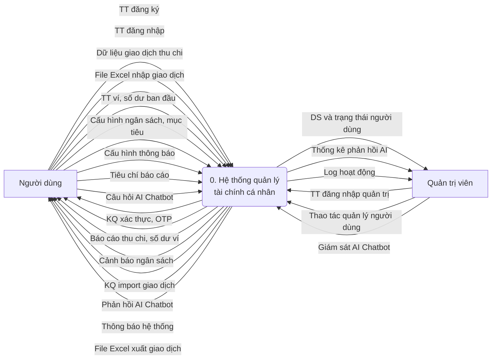
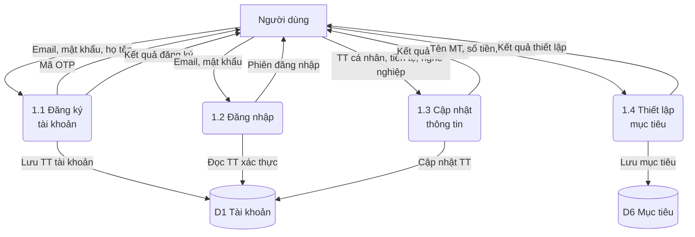
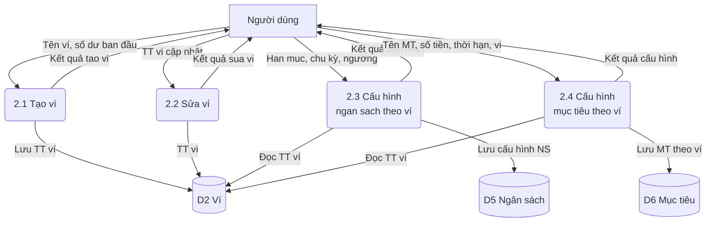
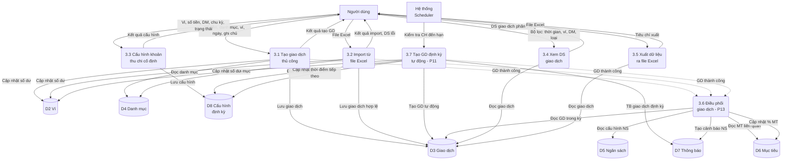
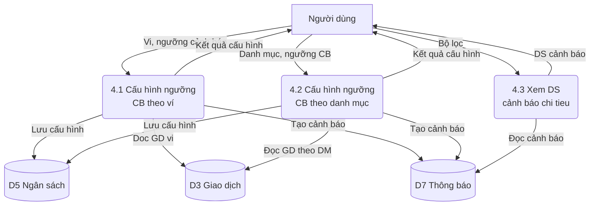
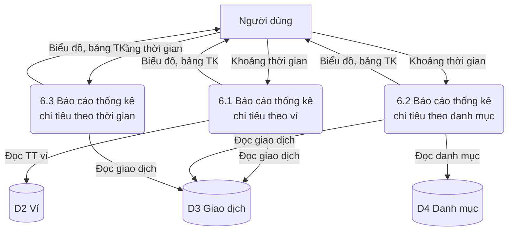
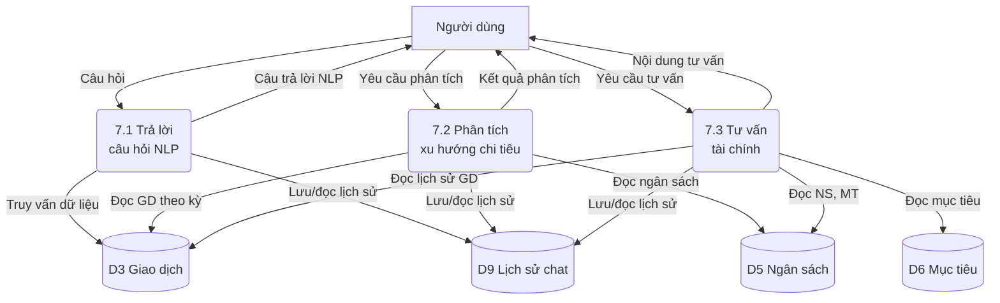
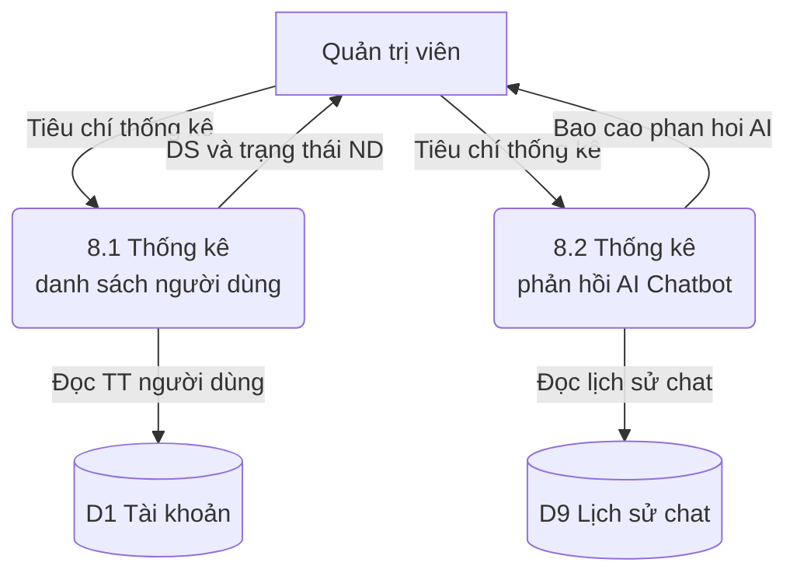

# 2.5. Mô hình hóa tiến trình nghiệp vụ

## 2.5.1. Ký hiệu sử dụng

| STT | Ký hiệu | Giải thích |
| :---: | :---: | ----- |
| 1 | Hình chữ nhật | Tác nhân trong/ngoài |
| 2 | Hình chữ nhật bo tròn | Tiến trình |
| 3 | Mũi tên | Luồng dữ liệu |
| 4 | Hình trụ | Kho dữ liệu |

Quy ước trong sơ đồ Mermaid:
- `["Tên"]` — Tác nhân (hình chữ nhật)
- `("Tên")` — Tiến trình (hình bo tròn)
- `[("Tên")]` — Kho dữ liệu (hình trụ)
- `-->|"Mô tả"|` — Luồng dữ liệu (mũi tên có nhãn)

---

## 2.5.2. Sơ đồ luồng dữ liệu (DFD) mức ngữ cảnh

Sơ đồ luồng dữ liệu mức ngữ cảnh thể hiện tổng quát hệ thống quản lý tài chính cá nhân như một tiến trình trung tâm duy nhất, tương tác với hai tác nhân bên ngoài: **Người dùng** và **Quản trị hệ thống**.

*Hình 2.4 Sơ đồ DFD mức ngữ cảnh*

**Mô tả luồng dữ liệu:**

| STT | Luồng | Mô tả |
|-----|-------|-------|
| 1 | Người dùng → Hệ thống | TT đăng ký; TT đăng nhập; dữ liệu giao dịch thu chi; file Excel nhập GD; TT ví, số dư; cấu hình ngân sách, mục tiêu; cấu hình thông báo; tiêu chí báo cáo; câu hỏi AI Chatbot |
| 2 | Hệ thống → Người dùng | KQ xác thực, OTP; báo cáo thu chi, số dư ví; cảnh báo ngân sách; KQ import GD; phản hồi AI Chatbot; thông báo hệ thống; file Excel xuất GD |
| 3 | Quản trị → Hệ thống | TT đăng nhập quản trị; thao tác quản lý người dùng; giám sát AI Chatbot |
| 4 | Hệ thống → Quản trị | DS và trạng thái người dùng; thống kê phản hồi AI; log hoạt động |

---

## 2.5.3. DFD mức đỉnh

Sơ đồ luồng dữ liệu mức đỉnh phân rã tiến trình trung tâm "Hệ thống quản lý tài chính cá nhân" thành **8 tiến trình con** tương ứng với 8 nhóm chức năng đã xác định, cùng **9 kho dữ liệu**, 3 tác nhân bên ngoài và **các luồng liên tiến trình** (P13 điều phối giao dịch kích hoạt P08, P12).

```mermaid
flowchart TB
    ND["Người dùng"]
    QT["Quản trị viên"]
    HT["Hệ thống\nScheduler"]

    P1("1.0\nQuản lý tài khoản")
    P2("2.0\nQuản lý ví")
    P3("3.0\nQuản lý thu chi")
    P4("4.0\nQuản lý ngân sách")
    P5("5.0\nQuản lý thông báo")
    P6("6.0\nBáo cáo thống kê")
    P7("7.0\nAI Chatbot")
    P8("8.0\nQuản lý hệ thống")

    D1[("D1 Tài khoản")]
    D2[("D2 Ví")]
    D3[("D3 Giao dịch")]
    D4[("D4 Danh mục")]
    D5[("D5 Ngân sách")]
    D6[("D6 Mục tiêu")]
    D7[("D7 Thông báo")]
    D8[("D8 Cấu hình\nđịnh kỳ")]
    D9[("D9 Lịch sử\nchat")]

    ND -->|"TT đăng ký, đăng nhập"| P1
    P1 -->|"KQ xác thực, OTP"| ND

    ND -->|"TT ví, cấu hình"| P2
    P2 -->|"DS ví, số dư"| ND

    ND -->|"Dữ liệu GD, file Excel"| P3
    P3 -->|"DS giao dịch, file Excel xuất"| ND

    ND -->|"Cấu hình ngưỡng theo ví/DM"| P4
    P4 -->|"DS cảnh báo chi tiêu"| ND

    ND -->|"Cấu hình thông báo"| P5
    P5 -->|"DS thông báo"| ND

    ND -->|"Tiêu chí báo cáo"| P6
    P6 -->|"Biểu đồ, bảng thống kê"| ND

    ND -->|"Câu hỏi, yêu cầu phân tích"| P7
    P7 -->|"Phản hồi NLP, phân tích, tư vấn"| ND

    QT -->|"Quản lý ND, giám sát AI"| P8
    P8 -->|"DS người dùng, thống kê AI"| QT

    HT -->|"Kích hoạt GD định kỳ"| P3
    HT -->|"Kích hoạt gửi TB định kỳ"| P5

    P3 -.->|"GD mới: Kiểm tra NS"| P4
    P3 -.->|"GD mới: Cập nhật MT"| P1
    P4 -.->|"Cảnh báo vượt NS"| P5

    P1 -->|"Lưu TT tài khoản"| D1
    P1 -->|"Đọc TT tài khoản"| D1
    P1 -->|"Lưu mục tiêu chung"| D6

    P2 -->|"Lưu TT ví"| D2
    P2 -->|"Đọc TT ví"| D2
    P2 -->|"Lưu cấu hình NS"| D5
    P2 -->|"Lưu mục tiêu theo ví"| D6

    P3 -->|"Lưu bản ghi GD"| D3
    P3 -->|"Đọc bản ghi GD"| D3
    P3 -->|"Cập nhật số dư ví"| D2
    P3 -->|"Đọc danh mục"| D4
    P3 -->|"Lưu cấu hình định kỳ"| D8
    P3 -->|"Đọc cấu hình định kỳ"| D8

    P4 -->|"Đọc cấu hình NS"| D5
    P4 -->|"Đọc GD trong kỳ"| D3
    P4 -->|"Lưu cảnh báo"| D7

    P5 -->|"Đọc thông báo"| D7
    P5 -->|"Lưu thông báo"| D7

    P6 -->|"Đọc GD"| D3
    P6 -->|"Đọc TT ví"| D2
    P6 -->|"Đọc danh mục"| D4

    P7 -->|"Đọc GD"| D3
    P7 -->|"Đọc NS"| D5
    P7 -->|"Đọc mục tiêu"| D6
    P7 -->|"Lưu lịch sử chat"| D9
    P7 -->|"Đọc lịch sử chat"| D9

    P8 -->|"Đọc TT người dùng"| D1
    P8 -->|"Đọc phản hồi AI"| D9
```

*Hình 2.5 Sơ đồ DFD mức đỉnh*

**Danh sách tác nhân:**

| Ký hiệu | Tên | Mô tả |
|----------|-----|-------|
| ND | Người dùng | Cá nhân sử dụng hệ thống quản lý tài chính |
| QT | Quản trị viên | Người vận hành, giám sát hệ thống |
| HT | Hệ thống (Scheduler) | Bộ lập lịch tự động kích hoạt GD định kỳ (P11) và gửi thông báo (P16) |

**Danh sách kho dữ liệu:**

| Ký hiệu | Tên kho dữ liệu | Mô tả |
|----------|-----------------|-------|
| D1 | Tài khoản | Lưu trữ thông tin tài khoản người dùng, cấu hình cá nhân, mục tiêu |
| D2 | Ví | Thông tin ví tài chính, số dư hiện tại |
| D3 | Giao dịch | Các bản ghi giao dịch thu/chi (thủ công, import, định kỳ) |
| D4 | Danh mục | Danh mục phân loại giao dịch (Ăn uống, Di chuyển, ...) |
| D5 | Ngân sách | Cấu hình ngân sách chi tiêu theo ví/danh mục, ngưỡng cảnh báo |
| D6 | Mục tiêu | Mục tiêu tài chính chung và theo ví, tiến độ hoàn thành |
| D7 | Thông báo | Thông báo hệ thống, cảnh báo ngân sách, cấu hình gửi TB |
| D8 | Cấu hình định kỳ | Cấu hình giao dịch thu/chi cố định, trạng thái, thời điểm tiếp theo |
| D9 | Lịch sử chat | Lịch sử hội thoại AI Chatbot, câu hỏi và phản hồi |

**Luồng liên tiến trình (nét đứt):**

| Luồng | Mô tả | Quy trình liên quan |
|-------|-------|--------------------|
| 3.0 → 4.0 | Sau khi tạo giao dịch, kích hoạt kiểm tra ngân sách | P13 → P12 |
| 3.0 → 1.0 | Sau khi tạo giao dịch, cập nhật % hoàn thành mục tiêu | P13 → P08 |
| 4.0 → 5.0 | Khi vượt ngân sách, gửi cảnh báo ngay lập tức | P12 → P16 |

---

## 2.5.4. DFD mức dưới đỉnh

### 2.5.4.1. DFD mức 2 – Quản lý tài khoản

Phân rã tiến trình **1.0 Quản lý tài khoản** thành 4 tiến trình con tương ứng với các quy trình P01, P02, P03, P04.

*Hình 2.6 DFD mức 2 – Quản lý tài khoản*

---

### 2.5.4.2. DFD mức 2 – Quản lý ví

Phân rã tiến trình **2.0 Quản lý ví** thành 4 tiến trình con tương ứng với các quy trình P05, P06, P07.

*Hình 2.7 DFD mức 2 – Quản lý ví*

---

### 2.5.4.3. DFD mức 2 – Quản lý thu chi

Phân rã tiến trình **3.0 Quản lý thu chi** thành 7 tiến trình con tương ứng với các quy trình P09, P10, P11, P13, P08, P12. Bao gồm tiến trình **3.6 Điều phối giao dịch (P13)** — tiến trình nội bộ tự động kích hoạt kiểm tra ngân sách và cập nhật mục tiêu sau mỗi giao dịch.

*Hình 2.8 DFD mức 2 – Quản lý thu chi*

> **Ghi chú:** Nét đứt (`-.->`) thể hiện luồng kích hoạt nội bộ. Sau khi giao dịch được tạo thành công (từ 3.1, 3.2 hoặc 3.7), hệ thống tự động kích hoạt tiến trình **3.6 Điều phối giao dịch (P13)** để:
> - Kiểm tra cấu hình ngân sách → tạo cảnh báo nếu vượt ngưỡng (P12)
> - Kiểm tra mục tiêu tài chính → cập nhật % hoàn thành (P08)

---

### 2.5.4.4. DFD mức 2 – Quản lý ngân sách

Phân rã tiến trình **4.0 Quản lý ngân sách** thành 3 tiến trình con tương ứng với quy trình P12.

*Hình 2.9 DFD mức 2 – Quản lý ngân sách*

---

### 2.5.4.5. DFD mức 2 – Quản lý thông báo

Phân rã tiến trình **5.0 Quản lý thông báo** thành 4 tiến trình con tương ứng với các quy trình P15, P16. Bao gồm tiến trình **5.4 Gửi thông báo tự động (P16)** — nhận cảnh báo từ tiến trình 4.0 và gửi TB theo lịch.

*Hình 2.10 DFD mức 2 – Quản lý thông báo*

> **Ghi chú:** Tiến trình 5.4 xử lý hai loại thông báo:
> - **Thông báo theo lịch**: Gửi báo cáo định kỳ (tuần/tháng/quý/năm) theo cấu hình P15
> - **Thông báo tức thì**: Cảnh báo vượt ngân sách (từ P12), hoàn thành/quá hạn mục tiêu (từ P08) — gửi ngay không phụ thuộc lịch

---

### 2.5.4.6. DFD mức 2 – Quản lý báo cáo thống kê

Phân rã tiến trình **6.0 Báo cáo thống kê** thành 3 tiến trình con tương ứng với quy trình P14.

*Hình 2.11 DFD mức 2 – Báo cáo thống kê*

---

### 2.5.4.7. DFD mức 2 – AI Chatbot

Phân rã tiến trình **7.0 AI Chatbot** thành 3 tiến trình con tương ứng với các quy trình P17, P18, P19.

*Hình 2.12 DFD mức 2 – AI Chatbot*

---

### 2.5.4.8. DFD mức 2 – Quản lý hệ thống

Phân rã tiến trình **8.0 Quản lý hệ thống** thành 2 tiến trình con.

*Hình 2.13 DFD mức 2 – Quản lý hệ thống*

---

## Bảng tổng hợp ma trận Tiến trình – Kho dữ liệu

| Tiến trình | D1 | D2 | D3 | D4 | D5 | D6 | D7 | D8 | D9 |
|------------|:--:|:--:|:--:|:--:|:--:|:--:|:--:|:--:|:--:|
| 1.0 QL Tài khoản | R/W | | | | | W | | | |
| 2.0 QL Ví | | R/W | | | W | W | | | |
| 3.0 QL Thu chi | | W | R/W | R | | | | R/W | |
| 4.0 QL Ngân sách | | | R | | R | | W | | |
| 5.0 QL Thông báo | | | | | | | R/W | | |
| 6.0 Báo cáo TK | | R | R | R | | | | | |
| 7.0 AI Chatbot | | | R | | R | R | | | R/W |
| 8.0 QL Hệ thống | R | | | | | | | | R |

*Bảng 2.3 Ma trận CRUD Tiến trình – Kho dữ liệu (R: Đọc, W: Ghi, R/W: Đọc/Ghi)*

---

# 2.4. Đặc tả chức năng

## 2.4.1. Chức năng Quản lý tài khoản

### 2.4.1.1. Đăng ký

| Tên chức năng | Đăng ký tài khoản |
| :---- | :---- |
| **Tác nhân** | Người dùng |
| **Mô tả** | Chức năng này cho phép người dùng tạo mới tài khoản để sử dụng hệ thống quản lý tài chính cá nhân. Hệ thống hỗ trợ 2 phương thức: đăng ký bằng email và đăng ký bằng tài khoản Google |
| **Đầu vào** | - Với đăng ký bằng email: họ tên, địa chỉ email, mật khẩu, xác nhận mật khẩu, mã OTP xác thực - Với đăng ký bằng Google: xác nhận ủy quyền OAuth |
| **Đầu ra** | Tài khoản mới được tạo thành công và lưu vào CSDL |
| **Điều kiện trước** | - Email chưa tồn tại trong hệ thống - Người dùng chưa đăng nhập |
| **Điều kiện sau** | - Trường hợp thành công: Thông báo tạo tài khoản thành công, người dùng có thể đăng nhập - Trường hợp thất bại: Nhận thông báo lỗi và nguyên nhân cụ thể (email đã tồn tại, OTP sai, mật khẩu không đủ mạnh) |
| **Ngoại lệ** | - Nếu email đã tồn tại trong hệ thống, hiển thị thông báo lỗi và yêu cầu nhập email khác - Nếu mã OTP sai hoặc hết hạn (quá 2 phút), hiển thị thông báo và cho phép gửi lại OTP - Nếu xác thực OAuth thất bại, hiển thị thông báo lỗi và yêu cầu thử lại |
| **Các yêu cầu đặc biệt** | - OTP có hiệu lực 2 phút và chỉ sử dụng một lần - Mật khẩu phải có tối thiểu 8 ký tự, bao gồm chữ hoa, chữ thường, số và ký tự đặc biệt - Ghi log thời gian đăng ký để theo dõi |

*Bảng 2.4 Đặc tả chức năng Đăng ký tài khoản*

### 2.4.1.2. Đăng nhập

| Tên chức năng | Đăng nhập |
| :---- | :---- |
| **Tác nhân** | Người dùng |
| **Mô tả** | Chức năng này cho phép người dùng truy cập hệ thống bằng tài khoản đã đăng ký trước đó |
| **Đầu vào** | Thông tin đăng nhập: email, mật khẩu |
| **Đầu ra** | Truy cập thành công vào giao diện Tổng quan hoặc thông báo lỗi |
| **Điều kiện trước** | - Người dùng đã có tài khoản hợp lệ trong hệ thống - Người dùng chưa đăng nhập |
| **Điều kiện sau** | - Trường hợp thành công: Phiên đăng nhập được tạo, lưu trạng thái đăng nhập và điều hướng vào trang tổng quan - Trường hợp thất bại: Hiển thị thông báo lỗi cụ thể (sai email hoặc sai mật khẩu) |
| **Ngoại lệ** | - Nếu email không tồn tại trong hệ thống, hiển thị thông báo "Email không tồn tại" - Nếu mật khẩu sai, hiển thị thông báo "Mật khẩu không đúng" - Nếu tài khoản bị khóa, hiển thị thông báo tương ứng |
| **Các yêu cầu đặc biệt** | - Phân quyền đăng nhập: phân biệt vai trò Người dùng và Quản trị viên - Ghi log thời gian đăng nhập để theo dõi và kiểm tra sau này |

*Bảng 2.5 Đặc tả chức năng Đăng nhập*

### 2.4.1.3. Cập nhật thông tin

| Tên chức năng | Cập nhật thông tin |
| :---- | :---- |
| **Tác nhân** | Người dùng |
| **Mô tả** | Chức năng này cho phép người dùng cập nhật thông tin cá nhân và cấu hình ban đầu khi đăng nhập lần đầu |
| **Đầu vào** | Thông tin cá nhân: họ tên, ảnh đại diện, đơn vị tiền tệ mặc định, nghề nghiệp, mức lương/thu nhập hàng tháng |
| **Đầu ra** | Thông tin cá nhân được cập nhật thành công vào CSDL |
| **Điều kiện trước** | - Người dùng đã đăng nhập vào hệ thống - Người dùng chưa có cập nhật thông tin lần nào |
| **Điều kiện sau** | - Trường hợp thành công: Thông báo cập nhật thành công, hệ thống ghi nhận thông tin mới - Trường hợp thất bại: Nhận thông báo lỗi và nguyên nhân là các trường nhập không hợp lệ |
| **Ngoại lệ** | - Nếu thông tin nhập vào không hợp lệ hoặc thiếu trường bắt buộc, hiển thị thông báo lỗi cụ thể và yêu cầu nhập lại - Nếu mức lương nhập vào ≤ 0, hiển thị thông báo lỗi |
| **Các yêu cầu đặc biệt** | - Không cho phép bỏ trống các trường bắt buộc (đơn vị tiền tệ, nghề nghiệp) - Ghi log thời gian cập nhật để theo dõi |

*Bảng 2.6 Đặc tả chức năng Cập nhật thông tin*

### 2.4.1.4. Thiết lập mục tiêu

| Tên chức năng | Thiết lập mục tiêu |
| :---- | :---- |
| **Tác nhân** | Người dùng |
| **Mô tả** | Chức năng này cho phép người dùng tạo mục tiêu tài chính tổng quát và theo dõi tiến độ thực hiện |
| **Đầu vào** | Thông tin mục tiêu: tên mục tiêu, số tiền mục tiêu, thời hạn hoàn thành, ví liên kết (tùy chọn), ghi chú |
| **Đầu ra** | Mục tiêu được tạo thành công và hiển thị trong danh sách mục tiêu |
| **Điều kiện trước** | - Người dùng đã đăng nhập vào hệ thống |
| **Điều kiện sau** | - Trường hợp thành công: Thông tin mục tiêu được lưu vào CSDL, khởi tạo trạng thái "Đang thực hiện" và % hoàn thành = 0% - Trường hợp thất bại: Nhận thông báo lỗi và nguyên nhân cụ thể |
| **Ngoại lệ** | - Nếu số tiền mục tiêu ≤ 0, hiển thị thông báo "Số tiền phải lớn hơn 0" - Nếu thời hạn nhỏ hơn ngày hiện tại, hiển thị thông báo "Thời hạn không hợp lệ" - Nếu tên mục tiêu bị trùng, hiển thị cảnh báo |
| **Các yêu cầu đặc biệt** | - Hệ thống phải tự động tính toán và cập nhật % hoàn thành mục tiêu dựa trên số dư ví liên kết - Cần có giao diện trực quan hiển thị tiến độ mục tiêu (thanh progress bar) |

*Bảng 2.7 Đặc tả chức năng Thiết lập mục tiêu*

---

## 2.4.2. Chức năng Quản lý ví

### 2.4.2.1. Tạo ví

| Tên chức năng | Tạo ví |
| :---- | :---- |
| **Tác nhân** | Người dùng |
| **Mô tả** | Chức năng này cho phép người dùng tạo ví tài chính để quản lý và theo dõi dòng tiền |
| **Đầu vào** | Thông tin ví: tên ví, số dư ban đầu, biểu tượng/màu sắc (tùy chọn), ghi chú |
| **Đầu ra** | Ví mới được tạo thành công và hiển thị trong danh sách ví |
| **Điều kiện trước** | - Người dùng đã đăng nhập vào hệ thống |
| **Điều kiện sau** | - Trường hợp thành công: Thông báo tạo ví thành công, ví mới hiển thị trong danh sách - Trường hợp thất bại: Nhận thông báo lỗi và nguyên nhân cụ thể |
| **Ngoại lệ** | - Nếu số dư ban đầu < 0, hiển thị thông báo "Số dư không được âm" - Nếu tên ví bị trùng, hiển thị cảnh báo - Nếu thiếu thông tin bắt buộc (tên ví), hiển thị thông báo lỗi |
| **Các yêu cầu đặc biệt** | - Số dư phải ≥ 0 - Giao diện quản lý danh sách ví phải dễ sử dụng, hỗ trợ thao tác nhanh |

*Bảng 2.8 Đặc tả chức năng Tạo ví*

### 2.4.2.2. Sửa ví

| Tên chức năng | Sửa ví |
| :---- | :---- |
| **Tác nhân** | Người dùng |
| **Mô tả** | Chức năng này cho phép người dùng chỉnh sửa thông tin ví đã tạo |
| **Đầu vào** | Thông tin ví cần cập nhật: tên ví, số dư điều chỉnh, biểu tượng/màu sắc, ghi chú |
| **Đầu ra** | Thông tin ví được cập nhật thành công vào CSDL |
| **Điều kiện trước** | - Người dùng đã đăng nhập vào hệ thống - Ví phải tồn tại và thuộc quyền sở hữu của người dùng |
| **Điều kiện sau** | - Trường hợp thành công: Thông báo cập nhật ví thành công - Trường hợp thất bại: Nhận thông báo lỗi và nguyên nhân cụ thể |
| **Ngoại lệ** | - Nếu ví không tồn tại trên hệ thống, hiển thị thông báo lỗi  - Nếu thông tin nhập không hợp lệ, hiển thị thông báo lỗi |
| **Các yêu cầu đặc biệt** | - Ghi log thời gian cập nhật thông tin ví để theo dõi - Nếu điều chỉnh số dư thủ công, hệ thống phải tạo giao dịch điều chỉnh tương ứng |

*Bảng 2.9 Đặc tả chức năng Sửa ví*

### 2.4.2.3. Cấu hình ngân sách chi tiêu cho ví

| Tên chức năng | Cấu hình ngân sách chi tiêu theo ví |
| :---- | :---- |
| **Tác nhân** | Người dùng |
| **Mô tả** | Chức năng này cho phép người dùng thiết lập hạn mức chi tiêu cho từng ví theo chu kỳ thời gian |
| **Đầu vào** | Thông tin cấu hình: ví áp dụng, hạn mức chi tiêu (VNĐ), chu kỳ áp dụng (tháng/quý/năm), ngưỡng cảnh báo (%) |
| **Đầu ra** | Cấu hình ngân sách được lưu thành công vào CSDL |
| **Điều kiện trước** | - Người dùng đã đăng nhập vào hệ thống - Ví phải tồn tại và thuộc quyền sở hữu của người dùng |
| **Điều kiện sau** | - Trường hợp thành công: Hệ thống bắt đầu giám sát chi tiêu theo hạn mức đã cấu hình - Trường hợp thất bại: Nhận thông báo lỗi và nguyên nhân cụ thể |
| **Ngoại lệ** | - Nếu hạn mức ≤ 0, hiển thị thông báo "Hạn mức phải lớn hơn 0" - Nếu ví không tồn tại, hiển thị thông báo lỗi - Nếu ngưỡng cảnh báo không nằm trong khoảng 1-100%, hiển thị lỗi |
| **Các yêu cầu đặc biệt** | - Ngưỡng cảnh báo mặc định là 80% nếu người dùng không thiết lập - Ghi log thời gian cấu hình |

*Bảng 2.10 Đặc tả chức năng Cấu hình ngân sách chi tiêu cho ví*

### 2.4.2.4. Cấu hình mục tiêu cho ví

| Tên chức năng | Cấu hình mục tiêu theo ví |
| :---- | :---- |
| **Tác nhân** | Người dùng |
| **Mô tả** | Chức năng này cho phép người dùng thiết lập mục tiêu tài chính và liên kết với một ví cụ thể để theo dõi |
| **Đầu vào** | Thông tin mục tiêu: tên mục tiêu, số tiền mục tiêu (VNĐ), thời hạn hoàn thành, ví áp dụng |
| **Đầu ra** | Mục tiêu được tạo, liên kết với ví và hiển thị trong danh sách |
| **Điều kiện trước** | - Người dùng đã đăng nhập vào hệ thống - Ví phải tồn tại và thuộc quyền sở hữu của người dùng |
| **Điều kiện sau** | - Trường hợp thành công: Hệ thống theo dõi tiến độ mục tiêu, tự động cập nhật khi phát sinh giao dịch với ví liên kết - Trường hợp thất bại: Nhận thông báo lỗi |
| **Ngoại lệ** | - Nếu ví không tồn tại, hiển thị thông báo lỗi - Nếu số tiền mục tiêu ≤ 0, hiển thị thông báo lỗi - Nếu thời hạn nhỏ hơn ngày hiện tại, hiển thị lỗi |
| **Các yêu cầu đặc biệt** | - Tự động cập nhật % hoàn thành và trạng thái mục tiêu khi có giao dịch mới - Gửi thông báo khi mục tiêu đạt 100% hoặc quá hạn |

*Bảng 2.11 Đặc tả chức năng Cấu hình mục tiêu cho ví*

---

## 2.4.3. Chức năng Quản lý thu chi

### 2.4.3.1. Tạo giao dịch thủ công

| Tên chức năng | Tạo giao dịch thủ công |
| :---- | :---- |
| **Tác nhân** | Người dùng |
| **Mô tả** | Chức năng này cho phép người dùng ghi nhận một khoản thu hoặc chi phát sinh vào hệ thống |
| **Đầu vào** | Thông tin giao dịch: loại giao dịch (thu/chi), số tiền, danh mục, ngày giao dịch, ví áp dụng, ghi chú (tùy chọn) |
| **Đầu ra** | Giao dịch được lưu vào CSDL, số dư ví được cập nhật |
| **Điều kiện trước** | - Người dùng đã đăng nhập vào hệ thống - Ví phải tồn tại và thuộc quyền sở hữu |
| **Điều kiện sau** | - Trường hợp thành công: Giao dịch được lưu, số dư ví cập nhật, kích hoạt kiểm tra ngân sách (P13) - Trường hợp thất bại: Nhận thông báo lỗi và nguyên nhân cụ thể |
| **Ngoại lệ** | - Nếu số tiền ≤ 0, hiển thị thông báo "Số tiền phải lớn hơn 0" - Nếu ví không tồn tại, hiển thị lỗi - Nếu thiếu danh mục hoặc ví, hiển thị thông báo yêu cầu chọn |
| **Các yêu cầu đặc biệt** | - Sau khi tạo giao dịch thành công, hệ thống tự động kiểm tra ngân sách và tạo cảnh báo nếu vượt ngưỡng - Tự động cập nhật % hoàn thành mục tiêu nếu ví có liên kết mục tiêu |

*Bảng 2.12 Đặc tả chức năng Tạo giao dịch thủ công*

### 2.4.3.2. Tạo dữ liệu giao dịch từ file Excel

| Tên chức năng | Tạo dữ liệu giao dịch từ file Excel |
| :---- | :---- |
| **Tác nhân** | Người dùng |
| **Mô tả** | Chức năng này cho phép người dùng nhập hàng loạt giao dịch từ file Excel theo mẫu chuẩn của hệ thống |
| **Đầu vào** | File Excel (.xlsx) đúng định dạng mẫu, chứa các cột: loại giao dịch, số tiền, danh mục, ngày, ví, ghi chú |
| **Đầu ra** | Danh sách giao dịch hợp lệ được lưu vào CSDL, danh sách dòng lỗi được hiển thị |
| **Điều kiện trước** | - Người dùng đã đăng nhập vào hệ thống - File Excel đúng cấu trúc mẫu của hệ thống |
| **Điều kiện sau** | - Trường hợp thành công: Các giao dịch hợp lệ được lưu, số dư ví được cập nhật - Trường hợp thất bại: Hiển thị danh sách dòng lỗi với nguyên nhân cụ thể |
| **Ngoại lệ** | - Nếu file không đúng định dạng (.xlsx), hiển thị thông báo "File không đúng định dạng" - Nếu file có dòng dữ liệu không hợp lệ (số tiền âm, danh mục không tồn tại), hiển thị chi tiết từng dòng lỗi - Nếu file rỗng, hiển thị thông báo "Không có dữ liệu" |
| **Các yêu cầu đặc biệt** | - Hiển thị bản xem trước trước khi xác nhận lưu - Hỗ trợ tải file mẫu Excel từ hệ thống - Ghi log số lượng giao dịch import thành công và thất bại |

*Bảng 2.13 Đặc tả chức năng Tạo dữ liệu giao dịch từ file Excel*

### 2.4.3.3. Tạo khoản thu chi cố định

| Tên chức năng | Tạo khoản thu chi cố định |
| :---- | :---- |
| **Tác nhân** | Người dùng, Hệ thống (Scheduler) |
| **Mô tả** | Chức năng này cho phép người dùng cấu hình giao dịch định kỳ. Hệ thống tự động tạo giao dịch theo chu kỳ đã thiết lập |
| **Đầu vào** | Thông tin cấu hình: ví áp dụng, loại giao dịch (thu/chi), số tiền, danh mục, ngày bắt đầu, chu kỳ lặp (ngày/tuần/tháng/năm), trạng thái (bật/tắt) |
| **Đầu ra** | Cấu hình định kỳ được lưu; hệ thống tự động tạo giao dịch khi đến hạn |
| **Điều kiện trước** | - Người dùng đã đăng nhập vào hệ thống - Ví tồn tại và hợp lệ |
| **Điều kiện sau** | - Trường hợp thành công: Cấu hình được lưu vào CSDL; hệ thống tự động tạo giao dịch khi đến hạn và cập nhật số dư ví - Trường hợp thất bại: Nhận thông báo lỗi |
| **Ngoại lệ** | - Nếu ví không tồn tại, hiển thị thông báo lỗi - Nếu số tiền ≤ 0, hiển thị thông báo lỗi - Nếu hệ thống gặp lỗi khi thực thi tác vụ tự động, ghi log lỗi và gửi thông báo cho người dùng |
| **Các yêu cầu đặc biệt** | - Hệ thống phải hỗ trợ bật/tắt cấu hình định kỳ - Gửi thông báo cho người dùng sau mỗi lần tạo giao dịch tự động - Ghi log thời gian thực thi và kết quả |

*Bảng 2.14 Đặc tả chức năng Tạo khoản thu chi cố định*

### 2.4.3.4. Xem danh sách giao dịch theo bộ lọc

| Tên chức năng | Xem danh sách giao dịch theo bộ lọc |
| :---- | :---- |
| **Tác nhân** | Người dùng |
| **Mô tả** | Chức năng này cho phép người dùng tra cứu và xem danh sách giao dịch đã ghi nhận theo các tiêu chí lọc |
| **Đầu vào** | Bộ lọc: khoảng thời gian (từ ngày – đến ngày), loại giao dịch (thu/chi/tất cả), danh mục, ví, từ khóa tìm kiếm |
| **Đầu ra** | Danh sách giao dịch phù hợp với tiêu chí lọc, phân trang |
| **Điều kiện trước** | - Người dùng đã đăng nhập vào hệ thống |
| **Điều kiện sau** | - Trường hợp thành công: Danh sách giao dịch được hiển thị trên giao diện - Trường hợp không có dữ liệu: Hiển thị thông báo "Không có giao dịch phù hợp" |
| **Ngoại lệ** | - Nếu không có dữ liệu phù hợp, hiển thị thông báo rỗng phù hợp |
| **Các yêu cầu đặc biệt** | - Hỗ trợ phân trang - Sắp xếp mặc định theo ngày giao dịch giảm dần - Giao diện phải hiển thị tổng thu, tổng chi trong khoảng thời gian đã lọc |

*Bảng 2.15 Đặc tả chức năng Xem danh sách giao dịch theo bộ lọc*

### 2.4.3.5. Xuất dữ liệu giao dịch ra file Excel

| Tên chức năng | Xuất dữ liệu giao dịch ra file Excel |
| :---- | :---- |
| **Tác nhân** | Người dùng |
| **Mô tả** | Chức năng này cho phép người dùng xuất danh sách giao dịch ra file Excel để lưu trữ hoặc phân tích ngoại tuyến |
| **Đầu vào** | Bộ lọc: khoảng thời gian, loại giao dịch, danh mục, ví |
| **Đầu ra** | File Excel (.xlsx) chứa danh sách giao dịch theo bộ lọc |
| **Điều kiện trước** | - Người dùng đã đăng nhập - Có dữ liệu giao dịch trong hệ thống phù hợp với bộ lọc |
| **Điều kiện sau** | - Trường hợp thành công: File Excel được tạo và tải về thiết bị - Trường hợp thất bại: Hiển thị thông báo lỗi |
| **Ngoại lệ** | - Nếu không có dữ liệu để xuất, hiển thị thông báo "Không có dữ liệu phù hợp" - Nếu xảy ra lỗi khi tạo file, hiển thị thông báo lỗi hệ thống |
| **Các yêu cầu đặc biệt** | - File xuất đúng định dạng mẫu của hệ thống - File phải có header rõ ràng và dữ liệu được format đúng kiểu |

*Bảng 2.16 Đặc tả chức năng Xuất dữ liệu giao dịch ra file Excel*

---

## 2.4.4. Chức năng Quản lý ngân sách

### 2.4.4.1. Cấu hình ngưỡng thông báo khi vượt quá chi tiêu theo ví

| Tên chức năng | Cấu hình ngưỡng cảnh báo chi tiêu theo ví |
| :---- | :---- |
| **Tác nhân** | Người dùng |
| **Mô tả** | Chức năng này cho phép người dùng thiết lập ngưỡng phần trăm để hệ thống tự động tạo cảnh báo khi chi tiêu của một ví đạt hoặc vượt ngưỡng |
| **Đầu vào** | Thông tin cấu hình: ví áp dụng, hạn mức chi tiêu (VNĐ), chu kỳ (tháng/quý/năm), ngưỡng cảnh báo (%) |
| **Đầu ra** | Cấu hình ngưỡng được lưu thành công vào CSDL |
| **Điều kiện trước** | - Người dùng đã đăng nhập - Ví tồn tại và thuộc quyền sở hữu |
| **Điều kiện sau** | - Trường hợp thành công: Hệ thống giám sát chi tiêu theo ví và tạo cảnh báo khi đạt ngưỡng - Trường hợp thất bại: Nhận thông báo lỗi |
| **Ngoại lệ** | - Nếu hạn mức ≤ 0, hiển thị "Hạn mức phải lớn hơn 0" - Nếu ví không tồn tại, hiển thị lỗi - Nếu ngưỡng ngoài khoảng 1-100%, hiển thị lỗi |
| **Các yêu cầu đặc biệt** | - Ngưỡng mặc định 80% - Hỗ trợ hai mức: "Sắp vượt" (đạt ngưỡng) và "Đã vượt" (đạt 100%) - Ghi log cấu hình |

*Bảng 2.17 Đặc tả chức năng Cấu hình ngưỡng CB theo ví*

### 2.4.4.2. Cấu hình ngưỡng thông báo khi vượt quá chi tiêu theo danh mục

| Tên chức năng | Cấu hình ngưỡng cảnh báo chi tiêu theo danh mục |
| :---- | :---- |
| **Tác nhân** | Người dùng |
| **Mô tả** | Chức năng này cho phép người dùng thiết lập ngưỡng cảnh báo cho từng danh mục chi tiêu cụ thể |
| **Đầu vào** | Thông tin cấu hình: danh mục áp dụng, hạn mức chi tiêu (VNĐ), chu kỳ (tháng/quý/năm), ngưỡng cảnh báo (%) |
| **Đầu ra** | Cấu hình ngưỡng được lưu thành công vào CSDL |
| **Điều kiện trước** | - Người dùng đã đăng nhập - Danh mục hợp lệ và tồn tại |
| **Điều kiện sau** | - Trường hợp thành công: Hệ thống giám sát chi tiêu theo danh mục và tạo cảnh báo khi đạt ngưỡng - Trường hợp thất bại: Nhận thông báo lỗi |
| **Ngoại lệ** | - Nếu hạn mức ≤ 0, hiển thị lỗi - Nếu danh mục không tồn tại, hiển thị lỗi |
| **Các yêu cầu đặc biệt** | - Tương tự cấu hình theo ví, ngưỡng mặc định 80% |

*Bảng 2.18 Đặc tả chức năng Cấu hình ngưỡng CB theo danh mục*

### 2.4.4.3. Xem danh sách cảnh báo chi tiêu theo bộ lọc

| Tên chức năng | Xem danh sách cảnh báo chi tiêu |
| :---- | :---- |
| **Tác nhân** | Người dùng |
| **Mô tả** | Chức năng này cho phép người dùng xem lại các cảnh báo vượt ngân sách đã được hệ thống tạo |
| **Đầu vào** | Bộ lọc: khoảng thời gian, loại cảnh báo (sắp vượt/đã vượt), ví hoặc danh mục |
| **Đầu ra** | Danh sách cảnh báo chi tiêu phù hợp, phân trang |
| **Điều kiện trước** | - Người dùng đã đăng nhập |
| **Điều kiện sau** | - Trường hợp thành công: Danh sách cảnh báo hiển thị trên giao diện - Trường hợp không có dữ liệu: Hiển thị thông báo "Không có cảnh báo" |
| **Ngoại lệ** | - Nếu không có cảnh báo trong khoảng thời gian, hiển thị thông báo rỗng |
| **Các yêu cầu đặc biệt** | - Hiển thị rõ mức độ cảnh báo bằng màu sắc (vàng = sắp vượt 80%, đỏ = đã vượt 100%) - Hỗ trợ phân trang |

*Bảng 2.19 Đặc tả chức năng Xem danh sách cảnh báo chi tiêu*

---

## 2.4.5. Chức năng Quản lý thông báo

### 2.4.5.1. Bật tắt thông báo

| Tên chức năng | Bật/Tắt thông báo |
| :---- | :---- |
| **Tác nhân** | Người dùng |
| **Mô tả** | Chức năng này cho phép người dùng kích hoạt hoặc vô hiệu hóa chức năng nhận thông báo từ hệ thống |
| **Đầu vào** | Trạng thái: bật hoặc tắt |
| **Đầu ra** | Cập nhật trạng thái cấu hình thông báo thành công |
| **Điều kiện trước** | - Người dùng đã đăng nhập vào hệ thống |
| **Điều kiện sau** | - Trường hợp thành công: Hệ thống ghi nhận trạng thái mới, áp dụng ngay lập tức - Trường hợp thất bại: Hiển thị thông báo lỗi hệ thống |
| **Ngoại lệ** | - Nếu xảy ra lỗi hệ thống khi cập nhật, hiển thị thông báo lỗi và giữ nguyên trạng thái cũ |
| **Các yêu cầu đặc biệt** | - Thay đổi có hiệu lực ngay lập tức - Ghi log thời gian thay đổi |

*Bảng 2.20 Đặc tả chức năng Bật/Tắt thông báo*

### 2.4.5.2. Cấu hình thời gian gửi thông báo

| Tên chức năng | Cấu hình thời gian gửi thông báo |
| :---- | :---- |
| **Tác nhân** | Người dùng |
| **Mô tả** | Chức năng này cho phép người dùng thiết lập lịch gửi báo cáo và thông báo định kỳ |
| **Đầu vào** | Thông tin cấu hình: tần suất gửi (tuần/tháng/quý/năm), thời điểm gửi (ngày, giờ), loại báo cáo đính kèm |
| **Đầu ra** | Cấu hình lịch gửi thông báo được lưu thành công |
| **Điều kiện trước** | - Người dùng đã đăng nhập - Chức năng thông báo đang được bật |
| **Điều kiện sau** | - Trường hợp thành công: Lịch gửi thông báo được lưu vào CSDL, Scheduler tự động thực thi - Trường hợp thất bại: Hiển thị thông báo lỗi |
| **Ngoại lệ** | - Nếu thời gian cấu hình không hợp lệ, hiển thị lỗi - Nếu cấu hình bị trùng lặp, hiển thị cảnh báo |
| **Các yêu cầu đặc biệt** | - Hệ thống Scheduler phải hỗ trợ xử lý tự động theo lịch - Ghi log mỗi lần gửi thông báo |

*Bảng 2.21 Đặc tả chức năng Cấu hình thời gian gửi thông báo*

### 2.4.5.3. Xem danh sách thông báo theo bộ lọc

| Tên chức năng | Xem danh sách thông báo |
| :---- | :---- |
| **Tác nhân** | Người dùng |
| **Mô tả** | Chức năng này cho phép người dùng xem lại các thông báo đã nhận từ hệ thống theo tiêu chí lọc |
| **Đầu vào** | Bộ lọc: khoảng thời gian, loại thông báo (cảnh báo ngân sách, mục tiêu, định kỳ, hệ thống), trạng thái (đã đọc/chưa đọc) |
| **Đầu ra** | Danh sách thông báo phù hợp, phân trang |
| **Điều kiện trước** | - Người dùng đã đăng nhập |
| **Điều kiện sau** | - Trường hợp thành công: Danh sách thông báo hiển thị, trạng thái cập nhật thành "đã đọc" khi mở xem - Trường hợp không có dữ liệu: Hiển thị danh sách rỗng |
| **Ngoại lệ** | - Nếu không có thông báo phù hợp bộ lọc, hiển thị danh sách rỗng |
| **Các yêu cầu đặc biệt** | - Hỗ trợ phân trang - Hiển thị badge số thông báo chưa đọc trên icon thông báo |

*Bảng 2.22 Đặc tả chức năng Xem danh sách thông báo*

---

## 2.4.6. Chức năng Báo cáo thống kê

### 2.4.6.1. Xem báo cáo thống kê chi tiêu theo ví

| Tên chức năng | Báo cáo chi tiêu theo ví |
| :---- | :---- |
| **Tác nhân** | Người dùng |
| **Mô tả** | Chức năng này cho phép người dùng xem thống kê tổng thu và tổng chi của từng ví trong khoảng thời gian xác định |
| **Đầu vào** | Khoảng thời gian cần xem (từ ngày – đến ngày) |
| **Đầu ra** | Biểu đồ trực quan và bảng thống kê theo từng ví |
| **Điều kiện trước** | - Người dùng đã đăng nhập - Có dữ liệu giao dịch trong hệ thống |
| **Điều kiện sau** | - Trường hợp thành công: Báo cáo hiển thị trên giao diện với biểu đồ và số liệu - Trường hợp không có dữ liệu: Hiển thị thông báo "Chưa có dữ liệu" |
| **Ngoại lệ** | - Nếu không có dữ liệu trong khoảng thời gian đã chọn, hiển thị thông báo phù hợp |
| **Các yêu cầu đặc biệt** | - Hỗ trợ biểu đồ trực quan: cột, tròn, đường - Giao diện responsive, hiển thị tốt trên mobile |

*Bảng 2.23 Đặc tả chức năng Báo cáo chi tiêu theo ví*

### 2.4.6.2. Xem báo cáo thống kê chi tiêu theo danh mục

| Tên chức năng | Báo cáo chi tiêu theo danh mục |
| :---- | :---- |
| **Tác nhân** | Người dùng |
| **Mô tả** | Chức năng này cho phép người dùng xem thống kê và phân tích mức chi tiêu theo từng danh mục |
| **Đầu vào** | Khoảng thời gian cần xem (từ ngày – đến ngày) |
| **Đầu ra** | Biểu đồ tròn/cột và bảng thống kê theo danh mục |
| **Điều kiện trước** | - Người dùng đã đăng nhập - Có dữ liệu giao dịch |
| **Điều kiện sau** | - Trường hợp thành công: Báo cáo hiển thị trên giao diện - Trường hợp không có dữ liệu: Hiển thị thông báo |
| **Ngoại lệ** | - Nếu không có dữ liệu, hiển thị thông báo "Chưa có dữ liệu" |
| **Các yêu cầu đặc biệt** | - Tự động tính tỷ lệ phần trăm từng danh mục so với tổng chi - Biểu đồ tròn mặc định để trực quan hóa tỷ lệ |

*Bảng 2.24 Đặc tả chức năng Báo cáo chi tiêu theo danh mục*

### 2.4.6.3. Xem báo cáo thống kê chi tiêu theo thời gian

| Tên chức năng | Báo cáo chi tiêu theo thời gian |
| :---- | :---- |
| **Tác nhân** | Người dùng |
| **Mô tả** | Chức năng này cho phép người dùng xem xu hướng thu chi theo ngày, tuần, tháng hoặc năm |
| **Đầu vào** | Khoảng thời gian cần xem, đơn vị thời gian (ngày/tuần/tháng/năm) |
| **Đầu ra** | Biểu đồ đường thể hiện xu hướng và bảng thống kê |
| **Điều kiện trước** | - Người dùng đã đăng nhập - Có dữ liệu giao dịch |
| **Điều kiện sau** | - Trường hợp thành công: Báo cáo hiển thị trên giao diện - Trường hợp không có dữ liệu: Hiển thị thông báo |
| **Ngoại lệ** | - Nếu không có dữ liệu, hiển thị thông báo "Chưa có dữ liệu" |
| **Các yêu cầu đặc biệt** | - Biểu đồ đường mặc định, thể hiện xu hướng tăng/giảm chi tiêu - Hỗ trợ so sánh kỳ trước vs kỳ hiện tại |

*Bảng 2.25 Đặc tả chức năng Báo cáo chi tiêu theo thời gian*

---

## 2.4.7. AI Chatbot

### 2.4.7.1. Trả lời câu hỏi từ người dùng

| Tên chức năng | AI Chatbot trả lời câu hỏi |
| :---- | :---- |
| **Tác nhân** | Người dùng |
| **Mô tả** | Chức năng này cho phép người dùng tra cứu thông tin tài chính cá nhân thông qua hội thoại bằng ngôn ngữ tự nhiên |
| **Đầu vào** | Nội dung câu hỏi dưới dạng văn bản tự nhiên (tiếng Việt) |
| **Đầu ra** | Câu trả lời bằng ngôn ngữ tự nhiên, có thể kèm số liệu minh họa |
| **Điều kiện trước** | - Người dùng đã đăng nhập vào hệ thống |
| **Điều kiện sau** | - Trường hợp thành công: Câu trả lời được hiển thị, lịch sử hội thoại được lưu - Trường hợp thất bại: Hiển thị thông báo "Tôi chưa hiểu câu hỏi, vui lòng thử lại" |
| **Ngoại lệ** | - Nếu không nhận diện được ý định câu hỏi, trả lời thông báo gợi ý câu hỏi mẫu - Nếu hệ thống AI gặp lỗi kết nối, hiển thị thông báo lỗi |
| **Các yêu cầu đặc biệt** | - Sử dụng NLP và RAG pipeline để xử lý câu hỏi - Lưu lịch sử hội thoại để cải thiện chất lượng phản hồi - Ghi log thời gian phản hồi để giám sát hiệu suất |

*Bảng 2.26 Đặc tả chức năng AI Chatbot trả lời câu hỏi*

### 2.4.7.2. Phân tích xu hướng chi tiêu

| Tên chức năng | Phân tích xu hướng chi tiêu |
| :---- | :---- |
| **Tác nhân** | Người dùng |
| **Mô tả** | Chức năng này cho phép AI phân tích dữ liệu giao dịch để xác định xu hướng chi tiêu theo thời gian, so sánh các kỳ |
| **Đầu vào** | Yêu cầu phân tích từ người dùng, khoảng thời gian (tùy chọn) |
| **Đầu ra** | Nhận xét phân tích bằng ngôn ngữ tự nhiên kèm số liệu so sánh |
| **Điều kiện trước** | - Người dùng đã đăng nhập - Có dữ liệu giao dịch đủ để phân tích (tối thiểu 2 kỳ) |
| **Điều kiện sau** | - Trường hợp thành công: Kết quả phân tích được hiển thị, lịch sử lưu lại - Trường hợp thất bại: Thông báo dữ liệu chưa đủ |
| **Ngoại lệ** | - Nếu dữ liệu không đủ để phân tích (ít hơn 2 kỳ), hiển thị thông báo yêu cầu bổ sung - Nếu AI gặp lỗi, hiển thị thông báo lỗi hệ thống |
| **Các yêu cầu đặc biệt** | - Sử dụng thuật toán thống kê hoặc AI để phân tích - Kết quả phải có so sánh kỳ trước vs kỳ hiện tại - Ghi log thời gian phản hồi |

*Bảng 2.27 Đặc tả chức năng Phân tích xu hướng chi tiêu*

### 2.4.7.3. Tư vấn tài chính dựa trên lịch sử

| Tên chức năng | Tư vấn tài chính |
| :---- | :---- |
| **Tác nhân** | Người dùng |
| **Mô tả** | Chức năng này cho phép AI đưa ra khuyến nghị tài chính cá nhân hóa dựa trên dữ liệu thu chi, ngân sách và mục tiêu của người dùng |
| **Đầu vào** | Yêu cầu tư vấn từ người dùng; hệ thống tự động truy xuất: lịch sử giao dịch, ngân sách, thu nhập, mục tiêu |
| **Đầu ra** | Nội dung tư vấn cá nhân hóa bằng ngôn ngữ tự nhiên |
| **Điều kiện trước** | - Người dùng đã đăng nhập - Có dữ liệu giao dịch trong hệ thống |
| **Điều kiện sau** | - Trường hợp thành công: Nội dung tư vấn được hiển thị, lịch sử lưu lại - Trường hợp thất bại: Thông báo dữ liệu chưa đủ |
| **Ngoại lệ** | - Nếu thiếu dữ liệu lịch sử, hiển thị thông báo gợi ý bổ sung dữ liệu - Nếu AI gặp lỗi, hiển thị thông báo lỗi hệ thống |
| **Các yêu cầu đặc biệt** | - Tư vấn phải dựa trên dữ liệu thực tế của người dùng, không phải chung chung - Ghi log để giám sát chất lượng tư vấn |

*Bảng 2.28 Đặc tả chức năng Tư vấn tài chính*

---

## 2.4.8. Chức năng Quản lý hệ thống

### 2.4.8.1. Thống kê danh sách người dùng

| Tên chức năng | Thống kê danh sách người dùng |
| :---- | :---- |
| **Tác nhân** | Quản trị viên |
| **Mô tả** | Chức năng này cho phép quản trị viên xem danh sách tài khoản người dùng và trạng thái hoạt động của từng tài khoản trong hệ thống |
| **Đầu vào** | Bộ lọc: trạng thái tài khoản (hoạt động/bị khóa), khoảng thời gian đăng ký (từ ngày – đến ngày), từ khóa tìm kiếm (email, họ tên) |
| **Đầu ra** | Danh sách người dùng kèm thông tin chi tiết: email, họ tên, ngày đăng ký, trạng thái, số lượng giao dịch, lần đăng nhập gần nhất |
| **Điều kiện trước** | - Quản trị viên đã đăng nhập với quyền admin |
| **Điều kiện sau** | - Trường hợp thành công: Danh sách người dùng hiển thị trên giao diện quản trị - Trường hợp không có dữ liệu: Hiển thị danh sách rỗng |
| **Ngoại lệ** | - Nếu không có người dùng phù hợp tiêu chí, hiển thị danh sách rỗng - Nếu quản trị viên không có quyền admin, từ chối truy cập |
| **Các yêu cầu đặc biệt** | - Hỗ trợ phân trang - Hỗ trợ xuất danh sách ra file Excel - Ghi log hoạt động quản trị |

*Bảng 2.29 Đặc tả chức năng Thống kê danh sách người dùng*

### 2.4.8.2. Thống kê phản hồi AI Chatbot

| Tên chức năng | Thống kê phản hồi AI Chatbot |
| :---- | :---- |
| **Tác nhân** | Quản trị viên |
| **Mô tả** | Chức năng này cho phép quản trị viên xem thống kê về hoạt động và chất lượng phản hồi của AI Chatbot để giám sát và cải thiện hiệu suất |
| **Đầu vào** | Bộ lọc: khoảng thời gian (từ ngày – đến ngày), loại câu hỏi (tra cứu/phân tích/tư vấn) |
| **Đầu ra** | Báo cáo thống kê: tổng số câu hỏi, tỷ lệ phản hồi thành công, thời gian phản hồi trung bình, danh sách câu hỏi phổ biến, biểu đồ trực quan |
| **Điều kiện trước** | - Quản trị viên đã đăng nhập với quyền admin |
| **Điều kiện sau** | - Trường hợp thành công: Báo cáo thống kê AI hiển thị trên giao diện quản trị - Trường hợp không có dữ liệu: Hiển thị thông báo "Chưa có dữ liệu chat" |
| **Ngoại lệ** | - Nếu không có dữ liệu chat trong khoảng thời gian, hiển thị thông báo phù hợp - Nếu quản trị viên không có quyền, từ chối truy cập |
| **Các yêu cầu đặc biệt** | - Hiển thị biểu đồ trực quan (cột, đường) - Hỗ trợ giám sát hiệu suất AI theo thời gian thực - Ghi log hoạt động tra cứu thống kê |

*Bảng 2.30 Đặc tả chức năng Thống kê phản hồi AI Chatbot*

### 2.4.8.3. Khóa/Mở khóa tài khoản người dùng

| Tên chức năng | Khóa/Mở khóa tài khoản người dùng |
| :---- | :---- |
| **Tác nhân** | Quản trị viên |
| **Mô tả** | Chức năng này cho phép quản trị viên khóa hoặc mở khóa tài khoản người dùng khi vi phạm chính sách hoặc theo yêu cầu |
| **Đầu vào** | Tài khoản người dùng cần thao tác, trạng thái mới (khóa/mở khóa), lý do (nếu khóa) |
| **Đầu ra** | Cập nhật trạng thái tài khoản thành công |
| **Điều kiện trước** | - Quản trị viên đã đăng nhập với quyền admin - Tài khoản người dùng phải tồn tại |
| **Điều kiện sau** | - Trường hợp thành công: Trạng thái tài khoản được cập nhật, người dùng nhận thông báo - Trường hợp thất bại: Hiển thị thông báo lỗi |
| **Ngoại lệ** | - Nếu tài khoản không tồn tại, hiển thị lỗi - Nếu quản trị viên không có quyền, từ chối thao tác |
| **Các yêu cầu đặc biệt** | - Ghi log thời gian, lý do khóa/mở khóa - Gửi email thông báo cho người dùng bị khóa |

*Bảng 2.31 Đặc tả chức năng Khóa/Mở khóa tài khoản*

### 2.4.8.4. Quản lý danh mục

| Tên chức năng | Quản lý danh mục |
| :---- | :---- |
| **Tác nhân** | Quản trị viên |
| **Mô tả** | Chức năng này cho phép quản trị viên quản lý danh sách các danh mục thu chi hệ thống (thêm, sửa, xóa, ẩn/hiện) |
| **Đầu vào** | Thông tin danh mục: tên danh mục, loại (thu/chi), biểu tượng, trạng thái (hoạt động/ẩn) |
| **Đầu ra** | Danh mục được tạo/cập nhật/xóa thành công |
| **Điều kiện trước** | - Quản trị viên đã đăng nhập với quyền admin |
| **Điều kiện sau** | - Trường hợp thành công: Danh mục được cập nhật trong CSDL - Trường hợp thất bại: Hiển thị thông báo lỗi |
| **Ngoại lệ** | - Nếu tên danh mục bị trùng, hiển thị cảnh báo - Nếu danh mục đang được sử dụng trong giao dịch, không cho phép xóa, chỉ cho phép ẩn |
| **Các yêu cầu đặc biệt** | - Danh mục hệ thống mặc định không thể xóa - Ghi log thời gian thay đổi |

*Bảng 2.32 Đặc tả chức năng Quản lý danh mục*

---

### 2.4.1.5. Đăng xuất

| Tên chức năng | Đăng xuất |
| :---- | :---- |
| **Tác nhân** | Người dùng |
| **Mô tả** | Chức năng này cho phép người dùng kết thúc phiên đăng nhập hiện tại và thoát khỏi hệ thống |
| **Đầu vào** | Yêu cầu đăng xuất từ người dùng |
| **Đầu ra** | Phiên đăng nhập bị hủy, điều hướng về trang đăng nhập |
| **Điều kiện trước** | - Người dùng đang đăng nhập trong hệ thống |
| **Điều kiện sau** | - Trường hợp thành công: Phiên đăng nhập bị hủy, token xác thực bị vô hiệu hóa - Trường hợp thất bại: Hiển thị thông báo lỗi |
| **Ngoại lệ** | - Nếu xảy ra lỗi hệ thống, buộc đăng xuất phía client |
| **Các yêu cầu đặc biệt** | - Ghi log thời gian đăng xuất |

*Bảng 2.33 Đặc tả chức năng Đăng xuất*

### 2.4.1.6. Quên mật khẩu

| Tên chức năng | Quên mật khẩu |
| :---- | :---- |
| **Tác nhân** | Người dùng |
| **Mô tả** | Chức năng này cho phép người dùng khôi phục mật khẩu khi quên, thông qua xác minh email đã đăng ký |
| **Đầu vào** | Email đã đăng ký, mã OTP xác thực, mật khẩu mới, xác nhận mật khẩu mới |
| **Đầu ra** | Mật khẩu được đặt lại thành công |
| **Điều kiện trước** | - Người dùng chưa đăng nhập - Email phải tồn tại trong hệ thống |
| **Điều kiện sau** | - Trường hợp thành công: Mật khẩu mới được lưu, người dùng có thể đăng nhập - Trường hợp thất bại: Hiển thị thông báo lỗi cụ thể |
| **Ngoại lệ** | - Nếu email không tồn tại, hiển thị "Email không tồn tại trong hệ thống" - Nếu OTP sai hoặc hết hạn, hiển thị thông báo và cho phép gửi lại - Nếu mật khẩu mới không đủ mạnh, hiển thị yêu cầu |
| **Các yêu cầu đặc biệt** | - OTP có hiệu lực 2 phút - Mật khẩu mới phải đáp ứng yêu cầu bảo mật - Ghi log thời gian đặt lại mật khẩu |

*Bảng 2.34 Đặc tả chức năng Quên mật khẩu*

### 2.4.1.7. Đổi mật khẩu

| Tên chức năng | Đổi mật khẩu |
| :---- | :---- |
| **Tác nhân** | Người dùng |
| **Mô tả** | Chức năng này cho phép người dùng thay đổi mật khẩu hiện tại khi đang đăng nhập |
| **Đầu vào** | Mật khẩu hiện tại, mật khẩu mới, xác nhận mật khẩu mới |
| **Đầu ra** | Mật khẩu được thay đổi thành công |
| **Điều kiện trước** | - Người dùng đã đăng nhập vào hệ thống |
| **Điều kiện sau** | - Trường hợp thành công: Mật khẩu mới được lưu, phiên đăng nhập vẫn giữ nguyên - Trường hợp thất bại: Hiển thị thông báo lỗi |
| **Ngoại lệ** | - Nếu mật khẩu hiện tại sai, hiển thị "Mật khẩu hiện tại không đúng" - Nếu mật khẩu mới trùng mật khẩu cũ, hiển thị cảnh báo - Nếu mật khẩu mới không đủ mạnh, hiển thị yêu cầu |
| **Các yêu cầu đặc biệt** | - Mật khẩu mới phải khác mật khẩu cũ - Ghi log thời gian đổi mật khẩu |

*Bảng 2.35 Đặc tả chức năng Đổi mật khẩu*

---

### 2.4.2.5. Xóa ví

| Tên chức năng | Xóa ví |
| :---- | :---- |
| **Tác nhân** | Người dùng |
| **Mô tả** | Chức năng này cho phép người dùng xóa ví tài chính không còn sử dụng |
| **Đầu vào** | Ví cần xóa, xác nhận xóa |
| **Đầu ra** | Ví được xóa khỏi hệ thống |
| **Điều kiện trước** | - Người dùng đã đăng nhập - Ví tồn tại và thuộc quyền sở hữu - Ví không có giao dịch định kỳ đang hoạt động |
| **Điều kiện sau** | - Trường hợp thành công: Ví bị xóa, giao dịch liên quan được lưu trữ lịch sử - Trường hợp thất bại: Hiển thị thông báo lỗi |
| **Ngoại lệ** | - Nếu ví có giao dịch định kỳ đang hoạt động, hiển thị cảnh báo và yêu cầu tắt trước - Nếu ví có liên kết mục tiêu, hiển thị cảnh báo |
| **Các yêu cầu đặc biệt** | - Yêu cầu xác nhận trước khi xóa - Ghi log thời gian xóa - Dữ liệu giao dịch lịch sử vẫn được bảo toàn |

*Bảng 2.36 Đặc tả chức năng Xóa ví*

### 2.4.2.6. Chuyển tiền giữa các ví

| Tên chức năng | Chuyển tiền giữa các ví |
| :---- | :---- |
| **Tác nhân** | Người dùng |
| **Mô tả** | Chức năng này cho phép người dùng chuyển tiền từ ví này sang ví khác trong hệ thống |
| **Đầu vào** | Ví nguồn, ví đích, số tiền chuyển, ghi chú (tùy chọn) |
| **Đầu ra** | Giao dịch chuyển tiền được ghi nhận, số dư 2 ví được cập nhật |
| **Điều kiện trước** | - Người dùng đã đăng nhập - Cả hai ví đều tồn tại - Ví nguồn có đủ số dư |
| **Điều kiện sau** | - Trường hợp thành công: Số dư ví nguồn giảm, ví đích tăng, 2 giao dịch được tạo - Trường hợp thất bại: Hiển thị thông báo lỗi, không thay đổi số dư |
| **Ngoại lệ** | - Nếu ví nguồn không đủ số dư, hiển thị "Số dư không đủ" - Nếu ví nguồn và ví đích trùng nhau, hiển thị lỗi - Nếu số tiền ≤ 0, hiển thị lỗi |
| **Các yêu cầu đặc biệt** | - Tạo 2 giao dịch liên kết: 1 chi (ví nguồn) và 1 thu (ví đích) - Ghi log giao dịch chuyển tiền |

*Bảng 2.37 Đặc tả chức năng Chuyển tiền giữa các ví*

---

### 2.4.3.6. Xem chi tiết giao dịch

| Tên chức năng | Xem chi tiết giao dịch |
| :---- | :---- |
| **Tác nhân** | Người dùng |
| **Mô tả** | Chức năng này cho phép người dùng xem thông tin chi tiết của một giao dịch cụ thể |
| **Đầu vào** | ID giao dịch cần xem |
| **Đầu ra** | Thông tin chi tiết giao dịch: loại, số tiền, danh mục, ví, ngày, ghi chú, trạng thái |
| **Điều kiện trước** | - Người dùng đã đăng nhập - Giao dịch tồn tại và thuộc quyền sở hữu |
| **Điều kiện sau** | - Trường hợp thành công: Chi tiết giao dịch hiển thị trên giao diện - Trường hợp thất bại: Hiển thị thông báo lỗi |
| **Ngoại lệ** | - Nếu giao dịch không tồn tại, hiển thị thông báo lỗi |
| **Các yêu cầu đặc biệt** | - Hiển thị rõ loại giao dịch (thủ công/import/định kỳ/chuyển ví) |

*Bảng 2.38 Đặc tả chức năng Xem chi tiết giao dịch*

### 2.4.3.7. Sửa giao dịch

| Tên chức năng | Sửa giao dịch |
| :---- | :---- |
| **Tác nhân** | Người dùng |
| **Mô tả** | Chức năng này cho phép người dùng chỉnh sửa thông tin giao dịch đã tạo khi có sai sót |
| **Đầu vào** | Thông tin giao dịch cần cập nhật: số tiền, danh mục, ngày, ví, ghi chú |
| **Đầu ra** | Giao dịch được cập nhật thành công |
| **Điều kiện trước** | - Người dùng đã đăng nhập - Giao dịch tồn tại và thuộc quyền sở hữu |
| **Điều kiện sau** | - Trường hợp thành công: Giao dịch được cập nhật, số dư ví được tính lại - Trường hợp thất bại: Hiển thị thông báo lỗi |
| **Ngoại lệ** | - Nếu giao dịch không tồn tại, hiển thị lỗi - Nếu thông tin không hợp lệ (số tiền ≤ 0), hiển thị lỗi |
| **Các yêu cầu đặc biệt** | - Hệ thống phải tính lại số dư ví sau khi sửa - Kích hoạt kiểm tra lại ngân sách nếu thay đổi số tiền - Ghi log thời gian sửa |

*Bảng 2.39 Đặc tả chức năng Sửa giao dịch*

### 2.4.3.8. Xóa giao dịch

| Tên chức năng | Xóa giao dịch |
| :---- | :---- |
| **Tác nhân** | Người dùng |
| **Mô tả** | Chức năng này cho phép người dùng xóa giao dịch đã tạo |
| **Đầu vào** | Giao dịch cần xóa, xác nhận xóa |
| **Đầu ra** | Giao dịch được xóa khỏi hệ thống |
| **Điều kiện trước** | - Người dùng đã đăng nhập - Giao dịch tồn tại và thuộc quyền sở hữu |
| **Điều kiện sau** | - Trường hợp thành công: Giao dịch bị xóa, số dư ví được hoàn lại - Trường hợp thất bại: Hiển thị thông báo lỗi |
| **Ngoại lệ** | - Nếu giao dịch không tồn tại, hiển thị lỗi - Nếu giao dịch thuộc loại tự động (định kỳ), hiển thị cảnh báo |
| **Các yêu cầu đặc biệt** | - Yêu cầu xác nhận trước khi xóa - Hệ thống phải hoàn lại số dư ví - Ghi log thời gian xóa |

*Bảng 2.40 Đặc tả chức năng Xóa giao dịch*

### 2.4.3.9. Sửa khoản thu chi cố định

| Tên chức năng | Sửa khoản thu chi cố định |
| :---- | :---- |
| **Tác nhân** | Người dùng |
| **Mô tả** | Chức năng này cho phép người dùng chỉnh sửa cấu hình giao dịch định kỳ đã tạo |
| **Đầu vào** | Thông tin cần cập nhật: số tiền, danh mục, chu kỳ, trạng thái (bật/tắt) |
| **Đầu ra** | Cấu hình định kỳ được cập nhật thành công |
| **Điều kiện trước** | - Người dùng đã đăng nhập - Khoản cố định tồn tại và thuộc quyền sở hữu |
| **Điều kiện sau** | - Trường hợp thành công: Cấu hình được cập nhật, lần thực thi tiếp theo áp dụng cấu hình mới - Trường hợp thất bại: Hiển thị thông báo lỗi |
| **Ngoại lệ** | - Nếu khoản cố định không tồn tại, hiển thị lỗi - Nếu thông tin không hợp lệ, hiển thị lỗi |
| **Các yêu cầu đặc biệt** | - Thay đổi áp dụng từ lần thực thi tiếp theo, không hồi tố - Ghi log thời gian sửa |

*Bảng 2.41 Đặc tả chức năng Sửa khoản thu chi cố định*

### 2.4.3.10. Xóa khoản thu chi cố định

| Tên chức năng | Xóa khoản thu chi cố định |
| :---- | :---- |
| **Tác nhân** | Người dùng |
| **Mô tả** | Chức năng này cho phép người dùng xóa cấu hình giao dịch định kỳ không còn sử dụng |
| **Đầu vào** | Khoản cố định cần xóa, xác nhận xóa |
| **Đầu ra** | Cấu hình định kỳ được xóa thành công |
| **Điều kiện trước** | - Người dùng đã đăng nhập - Khoản cố định tồn tại |
| **Điều kiện sau** | - Trường hợp thành công: Cấu hình bị xóa, hệ thống ngừng tạo giao dịch tự động - Trường hợp thất bại: Hiển thị thông báo lỗi |
| **Ngoại lệ** | - Nếu khoản cố định không tồn tại, hiển thị lỗi |
| **Các yêu cầu đặc biệt** | - Yêu cầu xác nhận trước khi xóa - Các giao dịch đã tạo trước đó không bị ảnh hưởng - Ghi log thời gian xóa |

*Bảng 2.42 Đặc tả chức năng Xóa khoản thu chi cố định*

---

### 2.4.4.4. Sửa cấu hình ngưỡng cảnh báo

| Tên chức năng | Sửa cấu hình ngưỡng cảnh báo |
| :---- | :---- |
| **Tác nhân** | Người dùng |
| **Mô tả** | Chức năng này cho phép người dùng chỉnh sửa ngưỡng cảnh báo chi tiêu đã cấu hình cho ví hoặc danh mục |
| **Đầu vào** | Thông tin cần cập nhật: hạn mức mới, chu kỳ mới, ngưỡng cảnh báo mới (%) |
| **Đầu ra** | Cấu hình ngưỡng được cập nhật thành công |
| **Điều kiện trước** | - Người dùng đã đăng nhập - Cấu hình ngưỡng tồn tại |
| **Điều kiện sau** | - Trường hợp thành công: Hệ thống áp dụng ngưỡng mới từ chu kỳ tiếp theo - Trường hợp thất bại: Hiển thị thông báo lỗi |
| **Ngoại lệ** | - Nếu hạn mức ≤ 0, hiển thị lỗi - Nếu ngưỡng ngoài 1-100%, hiển thị lỗi |
| **Các yêu cầu đặc biệt** | - Ghi log thời gian sửa |

*Bảng 2.43 Đặc tả chức năng Sửa cấu hình ngưỡng cảnh báo*

### 2.4.4.5. Xóa cấu hình ngưỡng cảnh báo

| Tên chức năng | Xóa cấu hình ngưỡng cảnh báo |
| :---- | :---- |
| **Tác nhân** | Người dùng |
| **Mô tả** | Chức năng này cho phép người dùng xóa ngưỡng cảnh báo chi tiêu đã cấu hình |
| **Đầu vào** | Cấu hình ngưỡng cần xóa, xác nhận xóa |
| **Đầu ra** | Cấu hình bị xóa khỏi hệ thống |
| **Điều kiện trước** | - Người dùng đã đăng nhập - Cấu hình ngưỡng tồn tại |
| **Điều kiện sau** | - Trường hợp thành công: Hệ thống ngừng giám sát chi tiêu theo cấu hình đã xóa - Trường hợp thất bại: Hiển thị thông báo lỗi |
| **Ngoại lệ** | - Nếu cấu hình không tồn tại, hiển thị lỗi |
| **Các yêu cầu đặc biệt** | - Yêu cầu xác nhận trước khi xóa - Ghi log thời gian xóa |

*Bảng 2.44 Đặc tả chức năng Xóa cấu hình ngưỡng cảnh báo*

---

### 2.4.5.4. Đánh dấu đã đọc/chưa đọc thông báo

| Tên chức năng | Đánh dấu đã đọc/chưa đọc thông báo |
| :---- | :---- |
| **Tác nhân** | Người dùng |
| **Mô tả** | Chức năng này cho phép người dùng đánh dấu thông báo là đã đọc hoặc chưa đọc để quản lý |
| **Đầu vào** | Thông báo cần đánh dấu, trạng thái mới (đã đọc/chưa đọc), hoặc "Đánh dấu tất cả đã đọc" |
| **Đầu ra** | Trạng thái thông báo được cập nhật |
| **Điều kiện trước** | - Người dùng đã đăng nhập - Thông báo tồn tại |
| **Điều kiện sau** | - Trường hợp thành công: Trạng thái được cập nhật, badge thông báo cập nhật - Trường hợp thất bại: Hiển thị thông báo lỗi |
| **Ngoại lệ** | - Nếu thông báo không tồn tại, hiển thị lỗi |
| **Các yêu cầu đặc biệt** | - Hỗ trợ đánh dấu hàng loạt - Badge số thông báo chưa đọc cập nhật realtime |

*Bảng 2.45 Đặc tả chức năng Đánh dấu thông báo*

### 2.4.5.5. Xóa thông báo

| Tên chức năng | Xóa thông báo |
| :---- | :---- |
| **Tác nhân** | Người dùng |
| **Mô tả** | Chức năng này cho phép người dùng xóa thông báo không còn cần thiết |
| **Đầu vào** | Thông báo cần xóa hoặc "Xóa tất cả đã đọc" |
| **Đầu ra** | Thông báo được xóa khỏi danh sách |
| **Điều kiện trước** | - Người dùng đã đăng nhập - Thông báo tồn tại |
| **Điều kiện sau** | - Trường hợp thành công: Thông báo bị xóa khỏi danh sách - Trường hợp thất bại: Hiển thị thông báo lỗi |
| **Ngoại lệ** | - Nếu thông báo không tồn tại, hiển thị lỗi |
| **Các yêu cầu đặc biệt** | - Hỗ trợ xóa hàng loạt - Yêu cầu xác nhận trước khi xóa tất cả |

*Bảng 2.46 Đặc tả chức năng Xóa thông báo*

---

### 2.4.6.4. Xem tổng quan tài chính (Dashboard)

| Tên chức năng | Xem tổng quan tài chính (Dashboard) |
| :---- | :---- |
| **Tác nhân** | Người dùng |
| **Mô tả** | Chức năng này hiển thị trang tổng quan với các chỉ số tài chính quan trọng: tổng thu, tổng chi, số dư, tiến độ mục tiêu, cảnh báo ngân sách |
| **Đầu vào** | Khoảng thời gian xem (mặc định: tháng hiện tại) |
| **Đầu ra** | Dashboard với biểu đồ tổng quan, widget chỉ số tài chính |
| **Điều kiện trước** | - Người dùng đã đăng nhập |
| **Điều kiện sau** | - Trường hợp thành công: Dashboard hiển thị đầy đủ các chỉ số - Trường hợp không có dữ liệu: Hiển thị giao diện trống với hướng dẫn |
| **Ngoại lệ** | - Nếu chưa có dữ liệu, hiển thị hướng dẫn tạo ví và giao dịch đầu tiên |
| **Các yêu cầu đặc biệt** | - Giao diện responsive - Dữ liệu realtime, tự động cập nhật khi có giao dịch mới - Hiển thị cảnh báo ngân sách nổi bật |

*Bảng 2.47 Đặc tả chức năng Dashboard*

---

### 2.4.7.4. Xem lịch sử hội thoại AI

| Tên chức năng | Xem lịch sử hội thoại AI |
| :---- | :---- |
| **Tác nhân** | Người dùng |
| **Mô tả** | Chức năng này cho phép người dùng xem lại các cuộc hội thoại trước đó với AI Chatbot |
| **Đầu vào** | Bộ lọc: khoảng thời gian, từ khóa tìm kiếm |
| **Đầu ra** | Danh sách các cuộc hội thoại, nội dung chi tiết từng cuộc |
| **Điều kiện trước** | - Người dùng đã đăng nhập - Có lịch sử hội thoại |
| **Điều kiện sau** | - Trường hợp thành công: Lịch sử hội thoại hiển thị phân trang - Trường hợp không có dữ liệu: Hiển thị danh sách rỗng |
| **Ngoại lệ** | - Nếu không có lịch sử, hiển thị thông báo phù hợp |
| **Các yêu cầu đặc biệt** | - Hỗ trợ tìm kiếm trong lịch sử - Phân trang |

*Bảng 2.48 Đặc tả chức năng Xem lịch sử hội thoại AI*

### 2.4.7.5. Xóa lịch sử hội thoại AI

| Tên chức năng | Xóa lịch sử hội thoại AI |
| :---- | :---- |
| **Tác nhân** | Người dùng |
| **Mô tả** | Chức năng này cho phép người dùng xóa lịch sử hội thoại với AI Chatbot |
| **Đầu vào** | Cuộc hội thoại cần xóa hoặc "Xóa tất cả lịch sử" |
| **Đầu ra** | Lịch sử hội thoại được xóa |
| **Điều kiện trước** | - Người dùng đã đăng nhập - Lịch sử hội thoại tồn tại |
| **Điều kiện sau** | - Trường hợp thành công: Lịch sử được xóa khỏi CSDL - Trường hợp thất bại: Hiển thị thông báo lỗi |
| **Ngoại lệ** | - Nếu lịch sử không tồn tại, hiển thị lỗi |
| **Các yêu cầu đặc biệt** | - Yêu cầu xác nhận trước khi xóa tất cả - Hỗ trợ xóa từng cuộc hoặc xóa hàng loạt |

*Bảng 2.49 Đặc tả chức năng Xóa lịch sử hội thoại AI*
