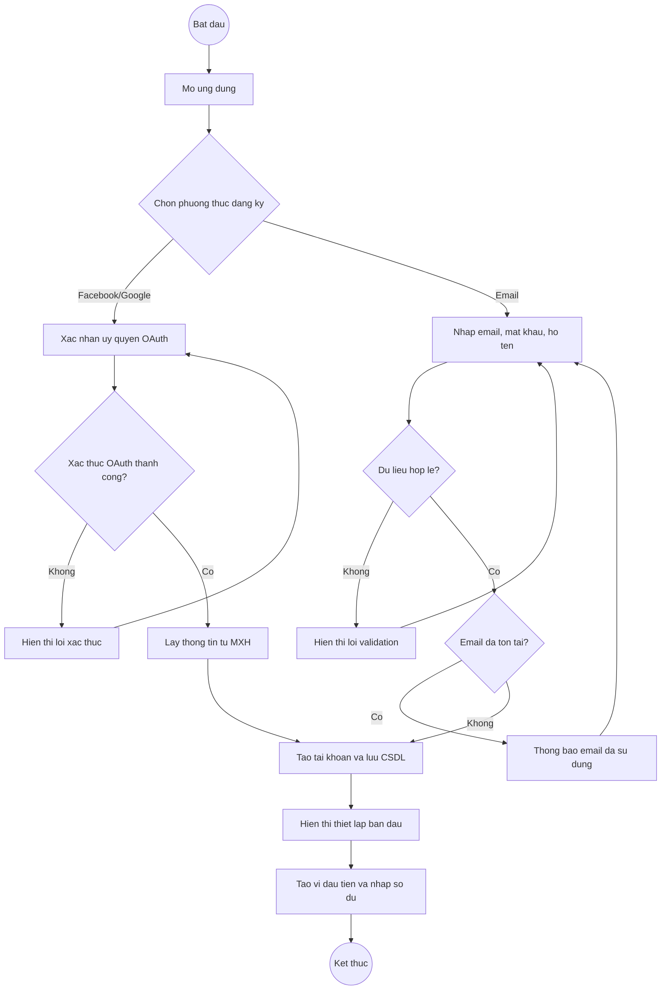
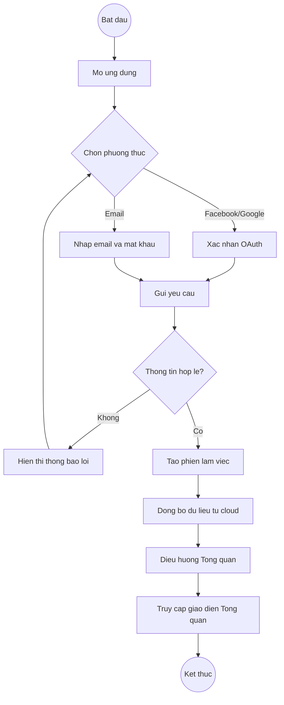
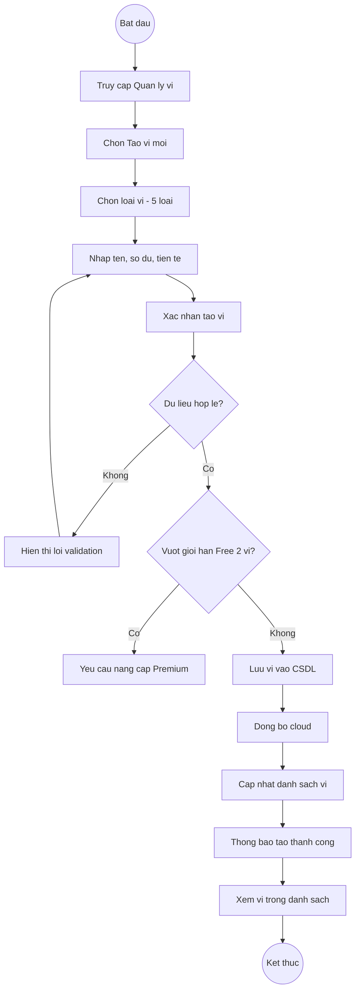
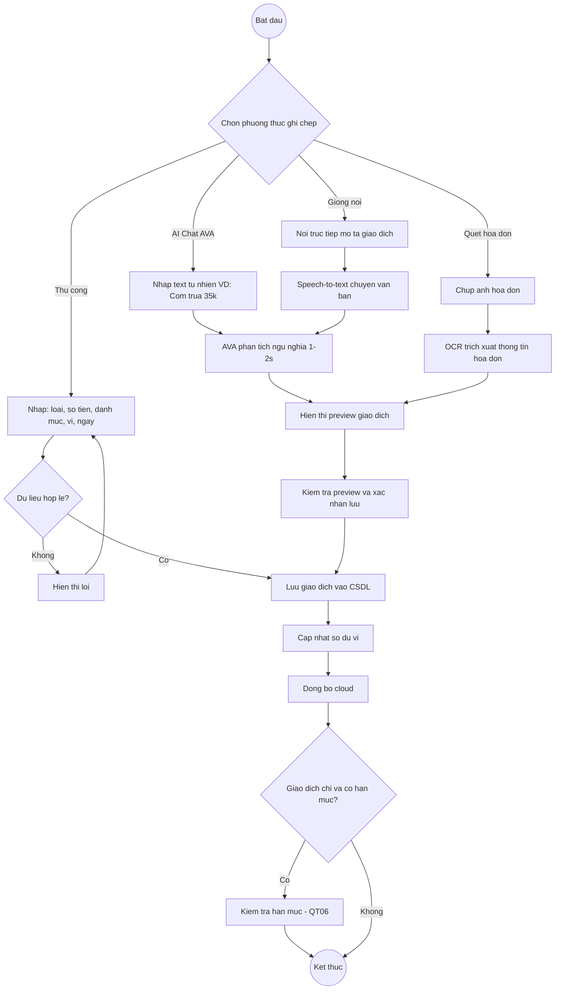
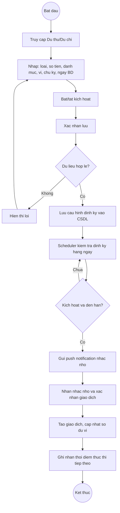
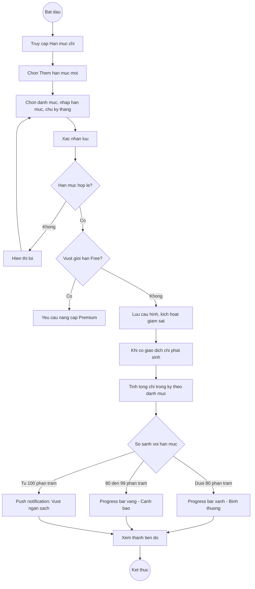
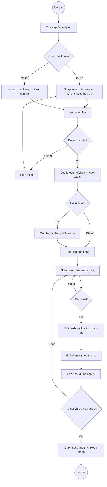
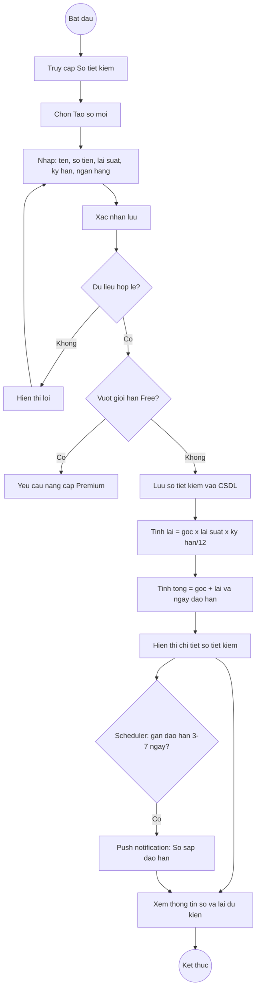
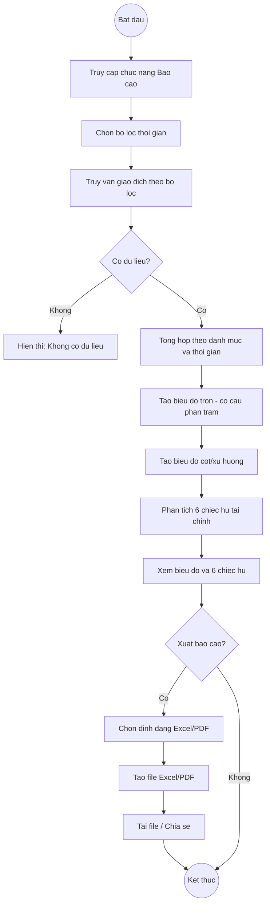
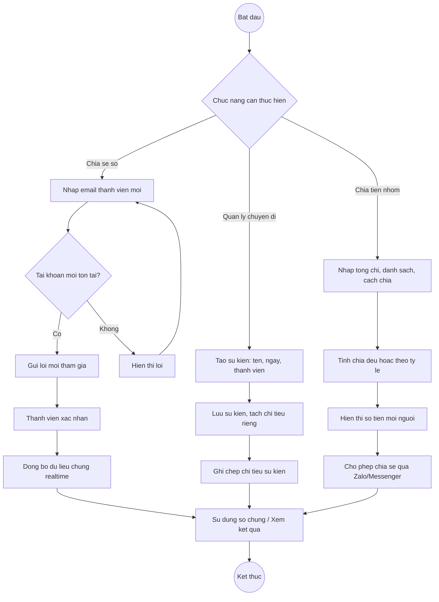

# NGHIÊN CỨU ỨNG DỤNG MISA MONEYKEEPER (SỔ THU CHI MISA)

## Giới thiệu

MISA MoneyKeeper (Sổ Thu Chi MISA) là ứng dụng quản lý thu chi cá nhân phát triển bởi Công ty Cổ phần MISA (MISA JSC) – doanh nghiệp phần mềm kế toán và quản trị doanh nghiệp với hơn 30 năm kinh nghiệm và 3.000 nhân sự tại Việt Nam. Ứng dụng hoạt động trên nền tảng iOS và Android, hiện có hơn 1 triệu lượt tải trên Google Play với đánh giá 4.7/5 sao (~50.000 đánh giá), phiên bản v85.6 (cập nhật 07/01/2026). Ứng dụng tích hợp trợ lý AI mang tên **AVA** hỗ trợ ghi chép siêu tốc bằng ngôn ngữ tự nhiên và giọng nói.

### Nguồn tham khảo chính thức

Toàn bộ quy trình nghiệp vụ và đặc tả chức năng trong tài liệu này được xác minh từ các nguồn chính thức sau:

| STT | Nguồn | URL | Loại |
|-----|-------|-----|------|
| 1 | Cổng hỗ trợ chính thức MISA MoneyKeeper | https://helpmoneykeeper.misa.vn/ | Tài liệu hướng dẫn (50+ bài viết) |
| 2 | Trang chủ MISA MoneyKeeper | https://moneykeeper.misa.vn/ | Giới thiệu sản phẩm |
| 3 | Google Play Store – Sổ Thu Chi MISA | https://play.google.com/store/apps/details?id=vn.misa.moneykeeper | Store listing, mô tả tính năng |
| 4 | Apple App Store – Sổ Thu Chi MISA | https://apps.apple.com/vn/app/id1012189823 | Store listing, mô tả tính năng |
| 5 | Trang tin MISA JSC | https://misa.vn/ | Thông tin công ty, bài viết kỹ thuật |

**Cấu trúc tài liệu hướng dẫn chính thức** (helpmoneykeeper.misa.vn) gồm 7 nhóm:
1. **Quản lý tài khoản** – 5 bài viết (tạo tài khoản, ví tiền mặt, ngân hàng, ví điện tử, thẻ tín dụng)
2. **Quản lý chi tiêu** – 13 bài viết (ghi chép thu/chi, dự thu/dự chi, hạn mức chi, chuyến đi/sự kiện, quét hóa đơn, quản lý theo đối tượng)
3. **Quản lý các khoản tiết kiệm** (sổ tiết kiệm, tất toán, theo dõi lãi)
4. **Ghi chép khoản tích lũy cá nhân** (mục tiêu tiết kiệm cá nhân)
5. **Xem thống kê báo cáo** (phân tích 6 chiếc hũ, biểu đồ thu chi)
6. **Tiện ích** – 6 bài viết (xuất dữ liệu, widget, tra cứu tỷ giá, chia tiền, tính thuế TNCN, tính lãi vay)
7. **Tính năng mới** (Premium, ví điện tử, chia tiền, AI AVA, giọng nói)

---

## I. QUY TRÌNH NGHIỆP VỤ

### QT01. Quy trình đăng ký tài khoản

- Quy trình đăng ký tài khoản được thực hiện khi người dùng lần đầu sử dụng ứng dụng MISA MoneyKeeper và có nhu cầu tạo mới tài khoản để sử dụng các chức năng quản lý tài chính cá nhân. Hệ thống cung cấp ba phương thức đăng ký: đăng ký bằng tài khoản Facebook, đăng ký bằng tài khoản Google và đăng ký bằng email. Người dùng lựa chọn phương thức phù hợp trên giao diện đăng ký của ứng dụng.
- Đối với phương thức đăng ký bằng Facebook hoặc Google, người dùng nhấn nút đăng nhập tương ứng trên giao diện. Hệ thống chuyển hướng sang giao diện xác thực OAuth của nhà cung cấp (Facebook hoặc Google). Người dùng đăng nhập vào tài khoản mạng xã hội và xác nhận ủy quyền cho ứng dụng MISA MoneyKeeper truy cập thông tin cơ bản (họ tên, email). Sau khi nhận được xác nhận ủy quyền thành công, hệ thống tự động lấy thông tin tên và email từ tài khoản mạng xã hội, tạo tài khoản MISA MoneyKeeper liên kết và lưu vào cơ sở dữ liệu. Trường hợp xác thực OAuth thất bại (người dùng từ chối ủy quyền hoặc lỗi kết nối), hệ thống hiển thị thông báo lỗi và yêu cầu người dùng thử lại hoặc chọn phương thức khác.
- Đối với phương thức đăng ký bằng email, người dùng cung cấp các thông tin cơ bản bao gồm địa chỉ email, mật khẩu và họ tên. Sau khi người dùng hoàn tất việc nhập liệu và gửi yêu cầu đăng ký, hệ thống tiến hành kiểm tra tính hợp lệ của dữ liệu đầu vào, bao gồm định dạng email hợp lệ, mật khẩu đủ độ dài tối thiểu và họ tên không để trống. Tiếp theo, hệ thống kiểm tra sự tồn tại của email trong cơ sở dữ liệu. Trường hợp email đã tồn tại, hệ thống hiển thị thông báo lỗi "Email đã được sử dụng" và yêu cầu người dùng nhập lại email khác. Trường hợp email chưa được sử dụng và dữ liệu hợp lệ, hệ thống tiến hành tạo tài khoản, lưu thông tin vào cơ sở dữ liệu và gửi email xác nhận đăng ký thành công.
- Sau khi đăng ký thành công (từ cả ba phương thức), hệ thống hiển thị giao diện hướng dẫn thiết lập ban đầu, yêu cầu người dùng tạo ví tài chính đầu tiên bằng cách chọn loại ví (tiền mặt hoặc tài khoản ngân hàng) và nhập số dư khởi tạo. Quy trình đăng ký hoàn tất khi tài khoản được tạo thành công, ví đầu tiên được thiết lập và người dùng có thể bắt đầu sử dụng ứng dụng để ghi chép thu chi.

### QT02. Quy trình đăng nhập

- Quy trình đăng nhập được áp dụng đối với người dùng đã có tài khoản hợp lệ trên hệ thống MISA MoneyKeeper. Người dùng mở ứng dụng và lựa chọn phương thức đăng nhập tương ứng với cách đã đăng ký trước đó: đăng nhập bằng tài khoản Facebook, đăng nhập bằng tài khoản Google hoặc đăng nhập bằng email và mật khẩu.
- Đối với đăng nhập bằng Facebook hoặc Google, hệ thống chuyển hướng sang giao diện xác thực OAuth của nhà cung cấp. Người dùng xác nhận đăng nhập trên giao diện OAuth. Hệ thống nhận token xác thực và kiểm tra tài khoản liên kết trong cơ sở dữ liệu. Đối với đăng nhập bằng email, người dùng nhập email và mật khẩu đã đăng ký trước đó. Sau khi gửi yêu cầu đăng nhập, hệ thống tiến hành kiểm tra tính hợp lệ của thông tin xác thực bằng cách so khớp email và mật khẩu (đã được mã hóa) trong cơ sở dữ liệu.
- Nếu email không tồn tại trong hệ thống hoặc mật khẩu không chính xác (đối với đăng nhập email), hoặc xác thực OAuth thất bại (đối với đăng nhập mạng xã hội), hệ thống hiển thị thông báo lỗi "Thông tin đăng nhập không chính xác" và yêu cầu người dùng nhập lại thông tin. Người dùng có thể thử lại hoặc chọn phương thức đăng nhập khác.
- Nếu thông tin xác thực hợp lệ, hệ thống tạo phiên làm việc (session) cho người dùng, tiến hành đồng bộ dữ liệu từ cloud server về thiết bị hiện tại (bao gồm ví, giao dịch, cấu hình ngân sách, sổ tiết kiệm và các thiết lập cá nhân) và điều hướng đến giao diện Tổng quan hiển thị tình hình thu chi hiện tại. Quy trình đăng nhập hoàn tất khi người dùng truy cập thành công vào ứng dụng và dữ liệu được đồng bộ đầy đủ.

### QT03. Quy trình tạo và quản lý ví

- Quy trình tạo ví được thực hiện khi người dùng đã đăng nhập vào ứng dụng và có nhu cầu tạo mới một ví tài chính để quản lý tiền từ các nguồn khác nhau. Hệ thống hỗ trợ năm loại ví: ví tiền mặt, tài khoản ngân hàng (BIDV, Vietcombank, Techcombank...), ví điện tử (MoMo, ZaloPay), thẻ tín dụng và tài khoản đầu tư. Người dùng truy cập chức năng Quản lý ví trên giao diện ứng dụng và chọn tạo ví mới.
- Hệ thống hiển thị biểu mẫu yêu cầu người dùng nhập các thông tin bao gồm: loại ví (chọn từ 5 loại), tên ví (ví dụ: "Tiền mặt", "TK Vietcombank"), số dư ban đầu và đơn vị tiền tệ (VND, USD, EUR hoặc ngoại tệ khác). Đối với loại thẻ tín dụng, hệ thống hiển thị thêm các trường bổ sung bao gồm hạn mức tín dụng và ngày thanh toán hàng tháng nhằm hỗ trợ nhắc nhở trả nợ thẻ.
- Sau khi người dùng xác nhận tạo ví, hệ thống tiến hành kiểm tra tính hợp lệ của dữ liệu đầu vào, đảm bảo số dư ban đầu ≥ 0, tên ví không để trống và không trùng lặp với ví đã tồn tại. Đồng thời, hệ thống kiểm tra giới hạn số lượng ví theo loại tài khoản: phiên bản miễn phí (Free) giới hạn tối đa 2 ví; phiên bản Premium cho phép tạo không giới hạn. Nếu người dùng Free đã có 2 ví và muốn tạo thêm, hệ thống hiển thị thông báo yêu cầu nâng cấp lên Premium.
- Nếu dữ liệu hợp lệ và chưa vượt giới hạn, hệ thống lưu thông tin ví vào cơ sở dữ liệu, liên kết với tài khoản người dùng tương ứng, đồng bộ lên cloud server và cập nhật danh sách ví trong giao diện. Hệ thống hiển thị thông báo tạo ví thành công. Người dùng cũng có thể chỉnh sửa thông tin ví (tên, số dư điều chỉnh) hoặc ẩn ví không còn sử dụng. Quy trình hoàn tất khi ví được tạo hoặc cập nhật thành công và hiển thị trong danh sách quản lý ví.

### QT04. Quy trình ghi chép giao dịch

- Quy trình ghi chép giao dịch là luồng nghiệp vụ cốt lõi của ứng dụng MISA MoneyKeeper, được kích hoạt khi người dùng đã đăng nhập và có nhu cầu ghi nhận một khoản thu hoặc chi phát sinh. Hệ thống cung cấp bốn phương thức ghi chép khác nhau, cho phép người dùng lựa chọn cách thuận tiện nhất.

- **Phương thức 1 – Ghi chép thủ công:** Người dùng nhấn biểu tượng (+) trên giao diện chính hoặc truy cập chức năng Thêm giao dịch. Hệ thống hiển thị biểu mẫu nhập liệu bao gồm: loại giao dịch (thu hoặc chi), số tiền, danh mục chi tiêu (được phân loại chi tiết: Ăn uống, Di chuyển, Mua sắm, Giải trí, Y tế, Giáo dục, Tiền nhà, Lương, Thưởng, Quà tặng và nhiều danh mục khác có thể tùy chỉnh), ví áp dụng, ngày giao dịch và ghi chú mô tả (tùy chọn). Sau khi người dùng hoàn tất nhập liệu và nhấn Lưu, hệ thống kiểm tra tính hợp lệ (số tiền > 0, danh mục và ví đã được chọn, ngày hợp lệ). Nếu dữ liệu không hợp lệ, hiển thị thông báo lỗi. Nếu hợp lệ, hệ thống lưu giao dịch vào cơ sở dữ liệu và cập nhật số dư ví tương ứng.

- **Phương thức 2 – Trợ lý AI AVA (Chat):** Người dùng truy cập chức năng Trợ lý AVA trên giao diện ứng dụng và nhập chuỗi văn bản bằng ngôn ngữ tự nhiên tiếng Việt mô tả giao dịch, ví dụ: "Cơm trưa 35k", "Đổ xăng 150 ngàn", "Grab đi làm 45.000 đ" hoặc "Mua cafe ví Tiền mặt 25k". Mô-đun AI của trợ lý AVA tiếp nhận chuỗi đầu vào và tiến hành phân tích ngữ nghĩa để trích xuất các thực thể chính: số tiền (35.000đ), danh mục phù hợp (Ăn uống) và ví áp dụng (nếu được đề cập). Quá trình phân tích diễn ra trong khoảng 1–2 giây. Hệ thống hiển thị bản xem trước giao dịch (preview) với số tiền, danh mục đã xác định và ví mặc định, cho phép người dùng kiểm tra, chỉnh sửa (nếu AI phân tích chưa chính xác) và xác nhận trước khi lưu. Trường hợp AVA không thể phân tích được nội dung (chuỗi quá mơ hồ hoặc không chứa thông tin số tiền), hệ thống yêu cầu người dùng nhập rõ hơn hoặc chuyển sang phương thức thủ công.

- **Phương thức 3 – Giọng nói (Voice-to-Record):** Người dùng nhấn nút microphone trên giao diện Trợ lý AVA và nói trực tiếp mô tả giao dịch bằng tiếng Việt (ví dụ: "Mua cà phê hai mươi lăm ngàn"). Hệ thống chuyển giọng nói thành văn bản thông qua công nghệ nhận dạng giọng nói (speech-to-text), yêu cầu thiết bị có kết nối internet và đã cấp quyền truy cập microphone. Chuỗi văn bản sau khi chuyển đổi được đưa vào mô-đun AI của trợ lý AVA để phân tích và trích xuất số tiền, danh mục tương tự phương thức Chat. Hệ thống hiển thị kết quả preview để người dùng xác nhận. Trường hợp không nhận diện được giọng nói (tiếng ồn quá lớn, phát âm không rõ) hoặc mất kết nối internet, hệ thống thông báo lỗi và đề nghị thử lại.

- **Phương thức 4 – Quét hóa đơn (Scan Receipt / OCR):** Người dùng nhấn nút Camera hoặc chức năng Quét hóa đơn trên giao diện. Hệ thống yêu cầu quyền truy cập camera (nếu chưa cấp). Người dùng chụp ảnh hóa đơn mua hàng trực tiếp bằng camera hoặc chọn ảnh hóa đơn từ thư viện điện thoại. Hệ thống áp dụng công nghệ OCR (Optical Character Recognition) để tự động nhận diện và trích xuất các thông tin trên hóa đơn bao gồm: tổng số tiền thanh toán, ngày giao dịch và nội dung/tên cửa hàng. Kết quả trích xuất được hiển thị dưới dạng giao dịch preview, cho phép người dùng kiểm tra và chỉnh sửa thông tin chưa chính xác (do ảnh mờ, hóa đơn bị nhàu hoặc font chữ khó đọc) trước khi xác nhận lưu. Phiên bản miễn phí (Free) giới hạn số lượt quét hóa đơn mỗi tháng; phiên bản Premium không giới hạn.

- Sau khi giao dịch được lưu thành công (từ cả bốn phương thức), hệ thống thực hiện ba tác vụ liên quan: (1) cập nhật số dư ví tương ứng (cộng thêm nếu thu, trừ đi nếu chi), (2) đồng bộ dữ liệu lên cloud server, và (3) kích hoạt quy trình kiểm tra hạn mức chi tiêu (QT06) nếu đây là giao dịch chi và danh mục tương ứng đã được cấu hình hạn mức. Quy trình ghi chép giao dịch hoàn tất khi giao dịch được lưu, số dư cập nhật và các kiểm tra liên quan được thực hiện thành công.

### QT05. Quy trình tạo giao dịch định kỳ (Dự thu/Dự chi)

- Quy trình cấu hình giao dịch định kỳ được thực hiện khi người dùng mong muốn thiết lập một khoản thu nhập hoặc chi phí được nhắc nhở hoặc ghi chép theo chu kỳ xác định, ví dụ: tiền lương hàng tháng (dự thu), tiền thuê nhà, hóa đơn điện nước, tiền internet, học phí (dự chi). Sau khi đăng nhập, người dùng truy cập chức năng Dự thu/Dự chi trên giao diện ứng dụng và chọn tạo cấu hình mới.
- Hệ thống hiển thị biểu mẫu yêu cầu người dùng nhập các thông tin bao gồm: loại giao dịch (thu hoặc chi), số tiền, danh mục, ví áp dụng, ngày bắt đầu hiệu lực và chu kỳ lặp (theo ngày, tuần, tháng hoặc năm). Người dùng có thể bật hoặc tắt trạng thái kích hoạt của cấu hình định kỳ. Sau khi người dùng xác nhận lưu, hệ thống kiểm tra tính hợp lệ của dữ liệu, đảm bảo các trường bắt buộc đã được nhập đầy đủ, số tiền > 0 và chu kỳ lặp hợp lệ. Nếu dữ liệu không hợp lệ, hệ thống hiển thị thông báo lỗi và yêu cầu chỉnh sửa. Nếu hợp lệ, hệ thống lưu cấu hình vào cơ sở dữ liệu và ghi nhận trạng thái kích hoạt.
- Trong quá trình vận hành hệ thống, bộ lập lịch (scheduler) định kỳ kiểm tra các cấu hình giao dịch định kỳ đã được thiết lập. Hệ thống chỉ xử lý các cấu hình thỏa mãn đồng thời hai điều kiện: cấu hình đang ở trạng thái kích hoạt (Bật) và thời điểm hiện tại đạt hoặc vượt thời điểm thực thi theo chu kỳ đã cấu hình. Khi phát hiện cấu hình đến hạn, hệ thống gửi push notification đến điện thoại người dùng để nhắc nhở ghi chép giao dịch tương ứng, kèm theo thông tin chi tiết (số tiền, danh mục, ví).
- Sau khi nhận thông báo, người dùng xác nhận để hệ thống tạo giao dịch, cập nhật số dư ví tương ứng và ghi nhận thời điểm thực thi tiếp theo. Quy trình hoàn tất khi giao dịch định kỳ được nhắc nhở và ghi chép thành công, hoặc khi cấu hình được lưu thành công nếu chỉ đang thiết lập lần đầu.

### QT06. Quy trình thiết lập và cảnh báo hạn mức chi tiêu

- Quy trình thiết lập hạn mức chi tiêu được thực hiện nhằm hỗ trợ người dùng kiểm soát mức chi tiêu trong một khoảng thời gian cụ thể theo từng danh mục chi tiêu. Sau khi đăng nhập, người dùng truy cập chức năng Hạn mức chi trên giao diện ứng dụng và chọn Thêm hạn mức mới. Người dùng lựa chọn danh mục cần áp dụng hạn mức (ví dụ: Ăn uống, Di chuyển, Mua sắm, Giải trí), nhập số tiền giới hạn chi tiêu tối đa và chu kỳ áp dụng (theo tháng).
- Hệ thống kiểm tra tính hợp lệ của dữ liệu đầu vào, đảm bảo hạn mức > 0 và danh mục hợp lệ. Đồng thời, hệ thống kiểm tra giới hạn số lượng hạn mức theo loại tài khoản: phiên bản Free giới hạn số lượng hạn mức có thể thiết lập; phiên bản Premium không giới hạn. Nếu hợp lệ, hệ thống lưu cấu hình ngân sách vào cơ sở dữ liệu và kích hoạt cơ chế giám sát chi tiêu. Giao diện ứng dụng hiển thị thanh tiến độ trực quan (progress bar) thể hiện tỷ lệ chi tiêu thực tế so với hạn mức đã cấu hình cho từng danh mục.
- Khi có giao dịch chi phát sinh thuộc danh mục đã thiết lập hạn mức, hệ thống tự động thực hiện các bước giám sát: truy vấn tất cả giao dịch chi thuộc danh mục đó trong kỳ hiện tại (tháng), tính tổng chi tiêu tích lũy và so sánh với hạn mức đã cấu hình. Hệ thống phân loại kết quả so sánh thành ba mức: (1) Nếu tổng chi < 80% hạn mức, thanh tiến độ hiển thị trạng thái bình thường (màu xanh). (2) Nếu tổng chi đạt từ 80% đến dưới 100% hạn mức, thanh tiến độ chuyển sang trạng thái cảnh báo (màu vàng/cam), nhắc nhở người dùng cần kiểm soát chi tiêu. (3) Nếu tổng chi đạt hoặc vượt 100% hạn mức, hệ thống tạo cảnh báo "Đã vượt ngân sách [Tên danh mục]" và gửi push notification trực tiếp đến điện thoại người dùng nhằm cảnh báo kịp thời.
- Quy trình hoàn tất khi cảnh báo được ghi nhận trong hệ thống và thông báo được gửi thành công đến người dùng.

---

### QT07. Quy trình quản lý vay nợ

- Quy trình quản lý vay nợ được kích hoạt khi người dùng đã đăng nhập và có nhu cầu ghi chép, theo dõi các khoản nợ đang có (tôi nợ ai) hoặc các khoản cho vay (ai nợ tôi). Người dùng truy cập chức năng Quản lý nợ trên giao diện ứng dụng và chọn tạo khoản mới. Hệ thống hiển thị tùy chọn loại khoản: "Khoản nợ" (tôi đang nợ người khác) hoặc "Khoản cho vay" (người khác đang nợ tôi).
- Hệ thống hiển thị biểu mẫu yêu cầu người dùng nhập các thông tin bao gồm: tên người cho vay hoặc người vay (bắt buộc), số tiền gốc (bắt buộc, > 0), lãi suất áp dụng (%/năm, tùy chọn – để trống nếu không tính lãi), ngày phát sinh khoản vay/nợ và hạn trả (ngày dự kiến hoàn tất trả nợ/thu nợ). Sau khi người dùng xác nhận lưu, hệ thống kiểm tra tính hợp lệ (số tiền > 0, hạn trả phải sau ngày hiện tại, các trường bắt buộc đã nhập đầy đủ). Nếu không hợp lệ, hiển thị thông báo lỗi. Nếu hợp lệ, hệ thống lưu bản ghi vay/nợ vào cơ sở dữ liệu và thiết lập lịch nhắc nhở tự động.
- Đối với khoản nợ/cho vay có lãi suất, hệ thống hỗ trợ công cụ tính lãi vay tự động. Người dùng nhập số tiền vay, lãi suất (%/năm) và kỳ hạn (tháng), hệ thống tính toán và hiển thị bảng lịch trả nợ chi tiết theo từng kỳ bao gồm: số tiền gốc phải trả mỗi kỳ, số tiền lãi mỗi kỳ và tổng lãi phải trả trong suốt kỳ hạn. Trong quá trình sử dụng, người dùng có thể ghi nhận từng lần trả nợ hoặc thu nợ bằng cách truy cập khoản nợ/cho vay tương ứng và nhập số tiền đã thanh toán/thu hồi. Hệ thống tự động cập nhật dư nợ còn lại sau mỗi lần ghi nhận.
- Khi đến hạn trả nợ hoặc ngày thanh toán thẻ tín dụng đã đến, bộ lập lịch (scheduler) của hệ thống phát hiện và gửi push notification nhắc nhở trực tiếp đến điện thoại người dùng. Đối với khoản cho vay (người khác nợ tôi), hệ thống nhắc nhở người dùng thu hồi nợ khi đến hạn. Quy trình hoàn tất khi khoản nợ hoặc cho vay được trả hết (dư nợ = 0) và trạng thái chuyển thành "Đã hoàn thành", hoặc khi nhắc nhở được gửi thành công đến người dùng.

### QT08. Quy trình quản lý sổ tiết kiệm

- Quy trình quản lý sổ tiết kiệm được thực hiện khi người dùng đã đăng nhập và muốn theo dõi các khoản tiền gửi tiết kiệm tại ngân hàng. Người dùng truy cập chức năng Sổ tiết kiệm trên giao diện ứng dụng và chọn tạo sổ mới. Hệ thống hiển thị biểu mẫu yêu cầu nhập các thông tin bao gồm: tên sổ tiết kiệm (ví dụ: "Sổ Vietcombank 12 tháng"), số tiền gửi (bắt buộc, > 0), lãi suất (%/năm, bắt buộc, > 0), kỳ hạn (tháng, bắt buộc), ngày gửi và ngân hàng.
- Sau khi người dùng xác nhận lưu, hệ thống kiểm tra tính hợp lệ (số tiền > 0, lãi suất > 0, kỳ hạn hợp lệ, các trường bắt buộc đầy đủ). Đồng thời kiểm tra giới hạn số sổ tiết kiệm theo loại tài khoản: phiên bản Free giới hạn số lượng sổ; phiên bản Premium không giới hạn. Nếu hợp lệ, hệ thống lưu thông tin sổ tiết kiệm vào cơ sở dữ liệu.
- Hệ thống tự động tính toán các thông tin tài chính dựa trên dữ liệu đã nhập: số tiền lãi dự kiến khi đáo hạn (= số tiền gửi × lãi suất × kỳ hạn / 12), tổng tiền nhận được khi đáo hạn (= gốc + lãi) và ngày đáo hạn chính xác (= ngày gửi + kỳ hạn). Kết quả được hiển thị trực quan trên giao diện chi tiết sổ tiết kiệm, bao gồm: tiền gốc, lãi dự kiến, tổng tiền đáo hạn, ngày đáo hạn và số ngày còn lại.
- Khi gần đến ngày đáo hạn (thông thường trước 3-7 ngày), bộ lập lịch (scheduler) của hệ thống phát hiện và gửi push notification đến điện thoại người dùng với nội dung nhắc nhở sổ tiết kiệm sắp đáo hạn, kèm thông tin số tiền gốc và lãi dự kiến, giúp người dùng quyết định tái gửi, rút tiền hoặc điều chỉnh kỳ hạn. Quy trình hoàn tất khi sổ tiết kiệm được tạo thành công và các thông tin tài chính được tính toán hiển thị chính xác.

### QT09. Quy trình tổng hợp báo cáo phân tích

- Quy trình tổng hợp báo cáo được thực hiện khi người dùng đã đăng nhập và truy cập chức năng Báo cáo nhằm xem xét và phân tích tình hình tài chính cá nhân trong một khoảng thời gian cụ thể. Hệ thống mặc định hiển thị báo cáo của tháng hiện tại. Người dùng có thể thay đổi bộ lọc thời gian sang các tùy chọn: tuần này, tháng này, quý này, năm nay hoặc khoảng thời gian tùy chỉnh (chọn ngày bắt đầu và ngày kết thúc).
- Khi nhận được yêu cầu xem báo cáo (mặc định hoặc sau khi thay đổi bộ lọc), hệ thống truy vấn tất cả dữ liệu giao dịch thuộc khoảng thời gian đã chọn từ cơ sở dữ liệu. Hệ thống tổng hợp và phân tích dữ liệu theo nhiều chiều, tạo ra ba loại báo cáo chính: (1) **Biểu đồ tròn (Pie Chart)** thể hiện cơ cấu chi tiêu theo từng danh mục, hiển thị tỷ trọng phần trăm và giá trị tuyệt đối của mỗi danh mục trong tổng chi tiêu, giúp người dùng nhận biết danh mục nào chiếm tỷ trọng lớn nhất và cần kiểm soát. (2) **Biểu đồ cột và xu hướng (Bar/Line Chart)** so sánh tổng thu và tổng chi giữa các tháng hoặc quý, thể hiện xu hướng tăng giảm chi tiêu theo thời gian, hỗ trợ người dùng nhận diện các biến động bất thường trong dòng tiền. (3) **Phân tích 6 chiếc hũ** theo quy tắc 6 chiếc hũ tài chính phổ biến: Nhu cầu thiết yếu (55%), Giáo dục (10%), Tiết kiệm dài hạn (10%), Hưởng thụ (10%), Tự do tài chính (10%) và Cho đi (5%). Hệ thống tự động phân loại các giao dịch chi tiêu vào 6 nhóm tương ứng dựa trên danh mục, tính tỷ lệ phân bổ thực tế của người dùng và hiển thị so sánh với tỷ lệ lý tưởng.
- Trường hợp không có dữ liệu giao dịch trong khoảng thời gian đã chọn, hệ thống hiển thị thông báo "Không có dữ liệu" và đề nghị người dùng chọn khoảng thời gian khác. Người dùng có thể xuất báo cáo ra file Excel hoặc PDF bằng cách chọn chức năng Xuất dữ liệu, lựa chọn định dạng mong muốn. Hệ thống tạo file chứa dữ liệu giao dịch và biểu đồ phân tích, cho phép người dùng tải về thiết bị hoặc chia sẻ qua các ứng dụng khác (email, Zalo, Messenger). Quy trình hoàn tất khi báo cáo được hiển thị đầy đủ và chính xác trên giao diện ứng dụng.

### QT10. Quy trình đồng bộ và chia sẻ tài khoản

- Quy trình đồng bộ dữ liệu diễn ra tự động và liên tục trong suốt quá trình sử dụng ứng dụng MISA MoneyKeeper. Mỗi khi người dùng thực hiện bất kỳ thao tác nào làm thay đổi dữ liệu (tạo giao dịch, chỉnh sửa ví, cấu hình hạn mức, tạo sổ tiết kiệm, ghi nhận trả nợ...), hệ thống tự động đồng bộ dữ liệu thay đổi lên cloud server của MISA. Dữ liệu được đồng bộ tức thời giữa các thiết bị khác nhau (điện thoại, máy tính bảng) đang đăng nhập cùng một tài khoản, đảm bảo tính nhất quán dữ liệu đa thiết bị. Trường hợp mất kết nối internet, hệ thống lưu dữ liệu cục bộ (offline) và tự động đồng bộ khi kết nối được khôi phục.
- Đối với chức năng chia sẻ tài khoản (tài khoản chung gia đình hoặc nhóm), người dùng truy cập phần Chia sẻ sổ thu chi trên giao diện cài đặt. Người dùng nhập email hoặc tài khoản MISA của thành viên muốn mời tham gia sổ chung. Hệ thống kiểm tra tài khoản được mời có tồn tại trong hệ thống hay không. Nếu không tồn tại, hiển thị thông báo lỗi. Nếu tồn tại, hệ thống gửi lời mời tham gia đến thành viên đó dưới dạng thông báo trong ứng dụng. Sau khi thành viên được mời xác nhận tham gia, cả hai hoặc nhiều thành viên có thể cùng ghi chép giao dịch vào sổ thu chi chung, xem báo cáo chung và quản lý ngân sách theo nhóm. Dữ liệu được đồng bộ realtime giữa tất cả thành viên trong sổ chung.
- Hệ thống cũng hỗ trợ chức năng quản lý chuyến đi/sự kiện theo nhóm. Người dùng tạo sự kiện (ví dụ: chuyến du lịch Đà Lạt, tiệc sinh nhật) bằng cách nhập tên sự kiện, ngày bắt đầu/kết thúc và danh sách thành viên tham gia. Trong suốt sự kiện, các giao dịch chi tiêu phát sinh được ghi chép riêng biệt vào sự kiện đó, tách khỏi chi tiêu cá nhân hàng ngày. Khi sự kiện kết thúc, người dùng có thể sử dụng chức năng chia tiền nhóm (bill splitting) để tính toán số tiền mỗi thành viên cần đóng góp: nhập tổng chi phí sự kiện, danh sách thành viên và chọn cách chia (chia đều hoặc chia theo tỷ lệ tùy chỉnh). Hệ thống tính toán và hiển thị số tiền mỗi người cần đóng, có thể chia sẻ kết quả cho thành viên qua Zalo, Messenger hoặc các ứng dụng khác.
- Quy trình hoàn tất khi dữ liệu được đồng bộ thành công giữa các thiết bị, thành viên tham gia sổ chung, hoặc kết quả chia tiền được hiển thị và chia sẻ.

---

## II. ĐẶC TẢ CHỨC NĂNG

### 1. Chức năng Quản lý tài khoản

#### 1.1. Đăng ký tài khoản

| Tên chức năng | Đăng ký tài khoản |
| :---- | :---- |
| **Tác nhân** | Người dùng |
| **Mô tả** | Cho phép người dùng tạo mới tài khoản MISA MoneyKeeper thông qua ba phương thức: Facebook, Google hoặc email. Đối với đăng ký email, hệ thống yêu cầu email, mật khẩu và họ tên. Đối với Facebook/Google, hệ thống xác thực OAuth và tự động lấy thông tin |
| **Đầu vào** | \- Đăng ký email: Địa chỉ email, mật khẩu, họ tên \- Đăng ký Facebook/Google: Xác thực ủy quyền OAuth |
| **Đầu ra** | \- Tài khoản được tạo thành công và lưu vào CSDL \- Hệ thống hiển thị giao diện thiết lập ví đầu tiên |
| **Điều kiện trước** | \- Email chưa tồn tại trong hệ thống (đối với đăng ký email) \- Tài khoản mạng xã hội chưa liên kết với tài khoản MISA nào (đối với Facebook/Google) |
| **Điều kiện sau** | \- Thành công: Tài khoản được lưu vào CSDL, người dùng được hướng dẫn tạo ví đầu tiên \- Thất bại: Hiển thị thông báo lỗi cụ thể (email đã tồn tại, dữ liệu không hợp lệ, xác thực OAuth thất bại) |
| **Ngoại lệ** | \- Email đã được sử dụng: hiển thị thông báo "Email đã tồn tại" \- Xác thực OAuth thất bại: người dùng từ chối ủy quyền hoặc lỗi kết nối \- Mất kết nối mạng: hiển thị lỗi kết nối |
| **Các yêu cầu đặc biệt** | Hỗ trợ 3 phương thức đăng ký: Facebook, Google, Email. Mật khẩu phải đáp ứng yêu cầu độ dài tối thiểu |

#### 1.2. Đăng nhập

| Tên chức năng | Đăng nhập |
| :---- | :---- |
| **Tác nhân** | Người dùng |
| **Mô tả** | Cho phép người dùng truy cập ứng dụng bằng tài khoản đã đăng ký trước đó. Hỗ trợ đăng nhập bằng email/mật khẩu hoặc xác thực OAuth (Facebook/Google). Sau khi xác thực thành công, hệ thống đồng bộ dữ liệu từ cloud và điều hướng đến Tổng quan |
| **Đầu vào** | \- Email và mật khẩu (đăng nhập email) \- Xác thực OAuth (đăng nhập Facebook/Google) |
| **Đầu ra** | \- Truy cập thành công vào giao diện Tổng quan \- Dữ liệu được đồng bộ đầy đủ từ cloud server |
| **Điều kiện trước** | Người dùng đã có tài khoản hợp lệ trong hệ thống |
| **Điều kiện sau** | \- Phiên đăng nhập (session) được tạo và lưu trạng thái \- Dữ liệu ví, giao dịch, cấu hình được đồng bộ \- Người dùng được điều hướng đến giao diện Tổng quan |
| **Ngoại lệ** | \- Sai email hoặc mật khẩu: hiển thị thông báo lỗi "Thông tin đăng nhập không chính xác" \- Xác thực OAuth thất bại \- Mất kết nối mạng |
| **Các yêu cầu đặc biệt** | Hỗ trợ ghi nhớ đăng nhập (stay logged in) để không cần nhập lại khi mở lại ứng dụng |

### 2. Chức năng Quản lý ví

#### 2.1. Tạo ví

| Tên chức năng | Tạo ví |
| :---- | :---- |
| **Tác nhân** | Người dùng |
| **Mô tả** | Cho phép tạo ví tài chính để quản lý tiền từ các nguồn khác nhau. Hỗ trợ 5 loại ví: tiền mặt, tài khoản ngân hàng (BIDV, Vietcombank...), ví điện tử (MoMo, ZaloPay), thẻ tín dụng và tài khoản đầu tư. Đối với thẻ tín dụng, bổ sung trường hạn mức và ngày thanh toán |
| **Đầu vào** | Loại ví (1 trong 5 loại), tên ví, số dư ban đầu, đơn vị tiền tệ (VND/USD/EUR/vàng). Riêng thẻ tín dụng: hạn mức tín dụng, ngày thanh toán hàng tháng |
| **Đầu ra** | \- Ví mới được tạo, liên kết với tài khoản người dùng \- Ví hiển thị trong danh sách quản lý ví |
| **Điều kiện trước** | \- Người dùng đã đăng nhập \- Phiên bản Free: chưa vượt giới hạn 2 ví |
| **Điều kiện sau** | \- Ví được lưu vào CSDL và đồng bộ cloud \- Ví sẵn sàng cho ghi chép giao dịch |
| **Ngoại lệ** | \- Số dư ban đầu < 0: hiển thị lỗi \- Tên ví trùng lặp: hiển thị lỗi \- Vượt giới hạn 2 ví (Free): yêu cầu nâng cấp Premium |
| **Các yêu cầu đặc biệt** | Hỗ trợ đa tiền tệ (VND, USD, EUR, vàng SJC). Free: tối đa 2 ví; Premium: không giới hạn |

### 3. Chức năng Ghi chép thu chi

#### 3.1. Ghi chép thủ công

| Tên chức năng | Ghi chép thu chi thủ công |
| :---- | :---- |
| **Tác nhân** | Người dùng |
| **Mô tả** | Cho phép ghi nhận khoản thu hoặc chi bằng cách nhập tay thông tin giao dịch vào biểu mẫu. Người dùng chọn loại (thu/chi), nhập số tiền, chọn danh mục, ví, ngày và ghi chú. Sau khi lưu, hệ thống cập nhật số dư ví và kiểm tra hạn mức |
| **Đầu vào** | Loại giao dịch (thu/chi), số tiền (> 0), danh mục chi tiêu (chọn từ danh sách), ví áp dụng, ngày giao dịch, ghi chú mô tả (tùy chọn) |
| **Đầu ra** | \- Giao dịch được lưu vào CSDL và lịch sử \- Số dư ví được cập nhật (cộng nếu thu, trừ nếu chi) |
| **Điều kiện trước** | \- Người dùng đã đăng nhập \- Có ít nhất 1 ví trong hệ thống |
| **Điều kiện sau** | \- Giao dịch hiển thị trong lịch sử \- Số dư ví cập nhật \- Kích hoạt kiểm tra hạn mức chi tiêu (QT06) nếu là giao dịch chi \- Dữ liệu đồng bộ cloud |
| **Ngoại lệ** | \- Số tiền ≤ 0: hiển thị lỗi \- Ví không tồn tại hoặc đã bị ẩn \- Danh mục chưa được chọn |
| **Các yêu cầu đặc biệt** | Hệ thống hỗ trợ danh mục phân loại chi tiết, người dùng có thể tùy chỉnh thêm danh mục mới |

#### 3.2. Ghi chép bằng Trợ lý AI AVA

| Tên chức năng | Ghi chép bằng AI Chat (Trợ lý AVA) |
| :---- | :---- |
| **Tác nhân** | Người dùng |
| **Mô tả** | Cho phép nhập giao dịch bằng ngôn ngữ tự nhiên tiếng Việt thông qua trợ lý AI AVA. Người dùng gõ chuỗi văn bản mô tả giao dịch (VD: "Cơm trưa 35k", "Đổ xăng 150 ngàn", "Mua cafe ví Tiền mặt 25k"). AVA tự động phân tích ngữ nghĩa, trích xuất số tiền và danh mục phù hợp trong 1–2 giây, hiển thị preview để xác nhận |
| **Đầu vào** | Chuỗi văn bản tiếng Việt mô tả giao dịch |
| **Đầu ra** | \- Giao dịch preview (số tiền, danh mục, ví tự động xác định) \- Sau xác nhận: giao dịch lưu, số dư cập nhật |
| **Điều kiện trước** | \- Người dùng đã đăng nhập \- Có ít nhất 1 ví \- Có kết nối internet (để xử lý AI) |
| **Điều kiện sau** | \- Giao dịch lưu vào CSDL \- Số dư ví cập nhật \- Kiểm tra hạn mức (QT06) nếu giao dịch chi |
| **Ngoại lệ** | \- AVA không parse được nội dung (chuỗi quá mơ hồ, thiếu số tiền): yêu cầu nhập rõ hơn \- Mất kết nối internet |
| **Các yêu cầu đặc biệt** | Thời gian phân tích ≤ 2 giây. Hỗ trợ các cách viết số tiền thông dụng tiếng Việt: "35k", "150 ngàn", "45.000 đ" |

#### 3.3. Ghi chép bằng giọng nói (Voice-to-Record)

| Tên chức năng | Ghi chép bằng giọng nói |
| :---- | :---- |
| **Tác nhân** | Người dùng |
| **Mô tả** | Cho phép nói trực tiếp mô tả giao dịch bằng tiếng Việt. Hệ thống chuyển giọng nói thành văn bản (speech-to-text), sau đó trợ lý AVA phân tích trích xuất số tiền và danh mục tương tự phương thức Chat. Hiển thị preview để xác nhận |
| **Đầu vào** | Giọng nói tiếng Việt mô tả giao dịch (VD: "Mua cà phê hai mươi lăm ngàn") |
| **Đầu ra** | \- Văn bản chuyển đổi từ giọng nói \- Giao dịch preview → sau xác nhận: giao dịch lưu |
| **Điều kiện trước** | \- Người dùng đã đăng nhập, có ít nhất 1 ví \- Đã cấp quyền truy cập microphone cho ứng dụng \- Có kết nối internet (cho speech-to-text và AI) |
| **Điều kiện sau** | \- Giao dịch lưu, số dư cập nhật (sau xác nhận) \- Kiểm tra hạn mức (QT06) nếu giao dịch chi |
| **Ngoại lệ** | \- Không nhận diện được giọng nói (tiếng ồn, phát âm không rõ) \- Mất kết nối internet \- Chưa cấp quyền microphone |
| **Các yêu cầu đặc biệt** | Yêu cầu kết nối internet cho cả hai bước: speech-to-text và phân tích AI |

#### 3.4. Quét hóa đơn (Scan Receipt / OCR)

| Tên chức năng | Quét hóa đơn |
| :---- | :---- |
| **Tác nhân** | Người dùng |
| **Mô tả** | Cho phép chụp ảnh hóa đơn mua hàng hoặc chọn từ thư viện ảnh. Hệ thống OCR tự động nhận diện và trích xuất số tiền, ngày giao dịch và nội dung trên hóa đơn. Hiển thị preview cho phép chỉnh sửa trước khi xác nhận lưu |
| **Đầu vào** | Ảnh hóa đơn (chụp trực tiếp bằng camera hoặc chọn từ thư viện điện thoại) |
| **Đầu ra** | \- Preview giao dịch với thông tin trích xuất từ hóa đơn \- Sau xác nhận: giao dịch lưu, số dư cập nhật |
| **Điều kiện trước** | \- Người dùng đã đăng nhập, có ít nhất 1 ví \- Đã cấp quyền truy cập camera/thư viện ảnh |
| **Điều kiện sau** | \- Giao dịch lưu, số dư cập nhật (sau xác nhận) \- Kiểm tra hạn mức (QT06) nếu giao dịch chi |
| **Ngoại lệ** | \- Ảnh không rõ nét, mờ hoặc bị che khuất \- OCR không trích xuất được thông tin (font chữ lạ, hóa đơn nhàu) \- Chưa cấp quyền camera |
| **Các yêu cầu đặc biệt** | Free: giới hạn số lượt quét hóa đơn mỗi tháng; Premium: không giới hạn |

### 4. Chức năng Quản lý ngân sách

#### 4.1. Thiết lập hạn mức chi tiêu

| Tên chức năng | Thiết lập hạn mức chi tiêu |
| :---- | :---- |
| **Tác nhân** | Người dùng |
| **Mô tả** | Cho phép thiết lập giới hạn chi tiêu tối đa theo từng danh mục trong chu kỳ tháng. Hệ thống hiển thị thanh tiến độ (progress bar) trực quan trên giao diện và tự động gửi push notification khi chi tiêu sắp vượt (≥ 80%) hoặc đã vượt (≥ 100%) hạn mức |
| **Đầu vào** | Danh mục áp dụng, hạn mức chi tiêu (VND, > 0), chu kỳ (tháng) |
| **Đầu ra** | \- Cấu hình ngân sách được lưu vào CSDL \- Thanh tiến độ hiển thị trên giao diện \- Push notification khi gần/vượt hạn mức |
| **Điều kiện trước** | \- Người dùng đã đăng nhập \- Phiên bản Free: chưa vượt giới hạn số hạn mức |
| **Điều kiện sau** | \- Hệ thống bắt đầu giám sát chi tiêu theo danh mục đã cấu hình \- Khi có giao dịch chi phát sinh: tự động kiểm tra và cảnh báo |
| **Ngoại lệ** | \- Hạn mức ≤ 0: hiển thị lỗi validation \- Danh mục không hợp lệ \- Vượt giới hạn Free: yêu cầu nâng cấp Premium |
| **Các yêu cầu đặc biệt** | Cảnh báo 3 mức: < 80% (xanh), 80-99% (vàng, cảnh báo), ≥ 100% (đỏ, push notification). Free: giới hạn số hạn mức; Premium: không giới hạn |

### 5. Chức năng Quản lý vay nợ

#### 5.1. Quản lý vay nợ

| Tên chức năng | Quản lý vay nợ |
| :---- | :---- |
| **Tác nhân** | Người dùng |
| **Mô tả** | Cho phép ghi chép và theo dõi khoản nợ (tôi nợ ai) hoặc khoản cho vay (ai nợ tôi). Hỗ trợ nhập thông tin người vay/cho vay, số tiền gốc, lãi suất, hạn trả. Hệ thống tính lãi vay tự động, ghi nhận từng lần trả nợ, cập nhật dư nợ và nhắc hạn trả bằng push notification |
| **Đầu vào** | Loại (nợ/cho vay), tên người cho vay/vay, số tiền gốc (> 0), lãi suất (%/năm, tùy chọn), ngày phát sinh, hạn trả |
| **Đầu ra** | \- Khoản nợ/cho vay được lưu vào CSDL \- Bảng lịch trả nợ (nếu có lãi suất) \- Lịch nhắc nhở được thiết lập |
| **Điều kiện trước** | Người dùng đã đăng nhập |
| **Điều kiện sau** | \- Khi đến hạn: gửi push notification nhắc trả/thu nợ \- Khi ghi nhận trả nợ: cập nhật dư nợ còn lại \- Khi trả hết (dư nợ = 0): trạng thái chuyển "Hoàn thành" |
| **Ngoại lệ** | \- Số tiền ≤ 0 \- Hạn trả không hợp lệ (trước ngày hiện tại) \- Các trường bắt buộc chưa nhập |
| **Các yêu cầu đặc biệt** | Hỗ trợ tính lãi vay tự động theo dư nợ, lãi suất và kỳ hạn. Nhắc hạn thanh toán thẻ tín dụng |

### 6. Chức năng Giao dịch định kỳ

#### 6.1. Dự thu / Dự chi

| Tên chức năng | Giao dịch định kỳ (Dự thu/Dự chi) |
| :---- | :---- |
| **Tác nhân** | Người dùng, Hệ thống |
| **Mô tả** | Cho phép người dùng cấu hình giao dịch định kỳ (lương hàng tháng, tiền thuê nhà, điện nước, học phí...) và hệ thống tự động nhắc nhở hoặc tạo giao dịch khi đến hạn theo chu kỳ đã thiết lập |
| **Đầu vào** | Loại giao dịch (thu/chi), số tiền (> 0), danh mục, ví áp dụng, chu kỳ lặp (ngày/tuần/tháng/năm), ngày bắt đầu, trạng thái kích hoạt (bật/tắt) |
| **Đầu ra** | \- Cấu hình định kỳ lưu vào CSDL \- Push notification nhắc nhở khi đến hạn \- Giao dịch được tạo sau khi xác nhận |
| **Điều kiện trước** | \- Người dùng đã đăng nhập \- Ví tồn tại và hợp lệ |
| **Điều kiện sau** | \- Cấu hình được lưu, scheduler lên lịch \- Khi đến hạn + đang kích hoạt: gửi nhắc nhở \- Sau xác nhận: giao dịch tạo, số dư cập nhật |
| **Ngoại lệ** | \- Số tiền ≤ 0 \- Chu kỳ lặp không hợp lệ \- Ví không tồn tại |
| **Các yêu cầu đặc biệt** | Hỗ trợ bật/tắt trạng thái kích hoạt mà không cần xóa cấu hình |

### 7. Chức năng Sổ tiết kiệm

#### 7.1. Quản lý sổ tiết kiệm

| Tên chức năng | Quản lý sổ tiết kiệm |
| :---- | :---- |
| **Tác nhân** | Người dùng |
| **Mô tả** | Cho phép tạo và theo dõi sổ tiết kiệm ngân hàng. Hệ thống tự động tính lãi dự kiến khi đáo hạn dựa trên số tiền gửi, lãi suất và kỳ hạn. Gửi push notification nhắc nhở khi sổ sắp đáo hạn (trước 3-7 ngày) |
| **Đầu vào** | Tên sổ, số tiền gửi (> 0), lãi suất (%/năm, > 0), kỳ hạn (tháng), ngày gửi, ngân hàng |
| **Đầu ra** | \- Sổ tiết kiệm lưu vào CSDL \- Hiển thị: tiền gốc, lãi dự kiến, tổng đáo hạn, ngày đáo hạn, số ngày còn lại |
| **Điều kiện trước** | \- Người dùng đã đăng nhập \- Phiên bản Free: chưa vượt giới hạn số sổ |
| **Điều kiện sau** | \- Lãi tự động tính: lãi = gốc × lãi suất × kỳ hạn / 12 \- Gần đáo hạn (3-7 ngày): gửi push notification nhắc |
| **Ngoại lệ** | \- Số tiền ≤ 0 hoặc lãi suất ≤ 0 \- Kỳ hạn không hợp lệ \- Vượt giới hạn Free: yêu cầu nâng cấp |
| **Các yêu cầu đặc biệt** | Free: giới hạn số sổ; Premium: không giới hạn |

### 8. Chức năng Báo cáo và phân tích

#### 8.1. Xem báo cáo phân tích thu chi

| Tên chức năng | Xem báo cáo phân tích thu chi |
| :---- | :---- |
| **Tác nhân** | Người dùng |
| **Mô tả** | Cung cấp hệ thống báo cáo phân tích thu chi đa chiều: biểu đồ tròn (cơ cấu chi tiêu theo danh mục, tỷ trọng %), biểu đồ cột/xu hướng (so sánh thu chi theo thời gian), và phân tích 6 chiếc hũ tài chính. Hỗ trợ xuất báo cáo ra file Excel/PDF |
| **Đầu vào** | Khoảng thời gian: tuần/tháng/quý/năm hoặc tùy chỉnh (ngày bắt đầu – ngày kết thúc) |
| **Đầu ra** | \- Biểu đồ tròn: % tỷ trọng từng danh mục \- Biểu đồ cột/xu hướng: so sánh thu chi theo tháng \- Báo cáo 6 chiếc hũ: tỷ lệ thực tế vs lý tưởng \- File Excel/PDF (nếu xuất) |
| **Điều kiện trước** | \- Người dùng đã đăng nhập \- Có dữ liệu giao dịch trong khoảng thời gian đã chọn |
| **Điều kiện sau** | \- Báo cáo hiển thị realtime trên giao diện \- Cập nhật khi thay đổi bộ lọc thời gian |
| **Ngoại lệ** | Không có dữ liệu trong khoảng thời gian: hiển thị "Không có dữ liệu" |
| **Các yêu cầu đặc biệt** | Phân tích 6 chiếc hũ: Nhu cầu thiết yếu 55%, Giáo dục 10%, Tiết kiệm 10%, Hưởng thụ 10%, Tự do tài chính 10%, Cho đi 5%. Hỗ trợ xuất Excel và PDF |

### 9. Chức năng Tiện ích

#### 9.1. Chia sẻ sổ thu chi (Tài khoản chung)

| Tên chức năng | Chia sẻ sổ thu chi |
| :---- | :---- |
| **Tác nhân** | Người dùng |
| **Mô tả** | Cho phép chia sẻ sổ thu chi giữa nhiều thành viên gia đình hoặc nhóm. Sau khi thành viên được mời xác nhận, tất cả thành viên có thể cùng ghi chép giao dịch, xem báo cáo chung và quản lý ngân sách chung. Dữ liệu đồng bộ realtime |
| **Đầu vào** | Email hoặc tài khoản MISA của thành viên được mời |
| **Đầu ra** | \- Lời mời tham gia được gửi đến thành viên \- Sau xác nhận: thành viên tham gia sổ chung, dữ liệu đồng bộ |
| **Điều kiện trước** | \- Người dùng đã đăng nhập \- Cả hai bên đều có tài khoản MISA MoneyKeeper |
| **Điều kiện sau** | \- Thành viên mới có quyền ghi chép và xem báo cáo trong sổ chung \- Dữ liệu đồng bộ realtime giữa tất cả thành viên |
| **Ngoại lệ** | Tài khoản được mời không tồn tại trong hệ thống: hiển thị lỗi |
| **Các yêu cầu đặc biệt** | Hỗ trợ quản lý chuyến đi/sự kiện theo nhóm |

#### 9.2. Chia tiền nhóm (Bill Splitting)

| Tên chức năng | Chia tiền nhóm |
| :---- | :---- |
| **Tác nhân** | Người dùng |
| **Mô tả** | Cho phép tính toán chia chi phí giữa các thành viên sau chuyến đi hoặc sự kiện. Hỗ trợ chia đều hoặc chia theo tỷ lệ tùy chỉnh. Kết quả có thể chia sẻ qua Zalo, Messenger hoặc ứng dụng khác |
| **Đầu vào** | Tổng chi phí, danh sách thành viên, cách chia (đều / tỷ lệ tùy chỉnh) |
| **Đầu ra** | \- Số tiền mỗi thành viên cần đóng góp \- Cho phép chia sẻ kết quả |
| **Điều kiện trước** | Người dùng đã đăng nhập |
| **Điều kiện sau** | Kết quả chia tiền hiển thị, có thể chia sẻ qua ứng dụng khác |
| **Ngoại lệ** | Tổng chi phí ≤ 0; Số thành viên ≤ 0 |
| **Các yêu cầu đặc biệt** | Liên kết với chức năng quản lý chuyến đi/sự kiện |

#### 9.3. Tra cứu tỷ giá vàng và ngoại tệ

| Tên chức năng | Tra cứu tỷ giá |
| :---- | :---- |
| **Tác nhân** | Người dùng |
| **Mô tả** | Cung cấp bảng tra cứu tỷ giá vàng SJC, USD, EUR và các ngoại tệ khác, cập nhật tự động hàng ngày từ nguồn chính thức |
| **Đầu vào** | Loại tiền tệ hoặc vàng cần tra cứu |
| **Đầu ra** | Tỷ giá mua/bán hiện tại |
| **Điều kiện trước** | Có kết nối internet |
| **Điều kiện sau** | Tỷ giá hiển thị; cache lưu dữ liệu gần nhất |
| **Ngoại lệ** | Mất kết nối: hiển thị dữ liệu cache gần nhất |
| **Các yêu cầu đặc biệt** | Cập nhật tự động từ nguồn chính thức hàng ngày |

#### 9.4. Tính thuế thu nhập cá nhân

| Tên chức năng | Tính thuế TNCN |
| :---- | :---- |
| **Tác nhân** | Người dùng |
| **Mô tả** | Công cụ ước tính thuế thu nhập cá nhân hàng tháng dựa trên mức lương gross, số người phụ thuộc và các khoản bảo hiểm. Tính theo biểu thuế lũy tiến từng phần theo quy định pháp luật Việt Nam |
| **Đầu vào** | Lương gross hàng tháng, số người phụ thuộc, tỷ lệ bảo hiểm |
| **Đầu ra** | Thuế TNCN phải nộp hàng tháng, lương net sau thuế |
| **Điều kiện trước** | Người dùng đã đăng nhập |
| **Điều kiện sau** | Kết quả tính thuế hiển thị trên giao diện |
| **Ngoại lệ** | Lương ≤ 0: hiển thị lỗi |
| **Các yêu cầu đặc biệt** | Áp dụng biểu thuế lũy tiến 7 bậc theo quy định Việt Nam hiện hành |

#### 9.5. Tính lãi vay

| Tên chức năng | Tính lãi vay |
| :---- | :---- |
| **Tác nhân** | Người dùng |
| **Mô tả** | Công cụ tính toán số lãi phải trả khi vay ngân hàng. Hiển thị tổng lãi và bảng lịch trả nợ chi tiết theo từng kỳ. Hỗ trợ 2 phương thức tính: dư nợ giảm dần và trả đều hàng tháng |
| **Đầu vào** | Số tiền vay (> 0), lãi suất (%/năm, > 0), kỳ hạn (tháng), phương thức trả (dư nợ giảm dần / trả đều) |
| **Đầu ra** | \- Tổng lãi phải trả trong suốt kỳ hạn \- Bảng lịch trả nợ chi tiết: gốc + lãi mỗi kỳ |
| **Điều kiện trước** | Người dùng đã đăng nhập |
| **Điều kiện sau** | Kết quả tính lãi và lịch trả nợ hiển thị |
| **Ngoại lệ** | Số tiền ≤ 0; lãi suất ≤ 0; kỳ hạn ≤ 0 |
| **Các yêu cầu đặc biệt** | Hỗ trợ 2 phương thức: dư nợ giảm dần và trả đều hàng tháng |
